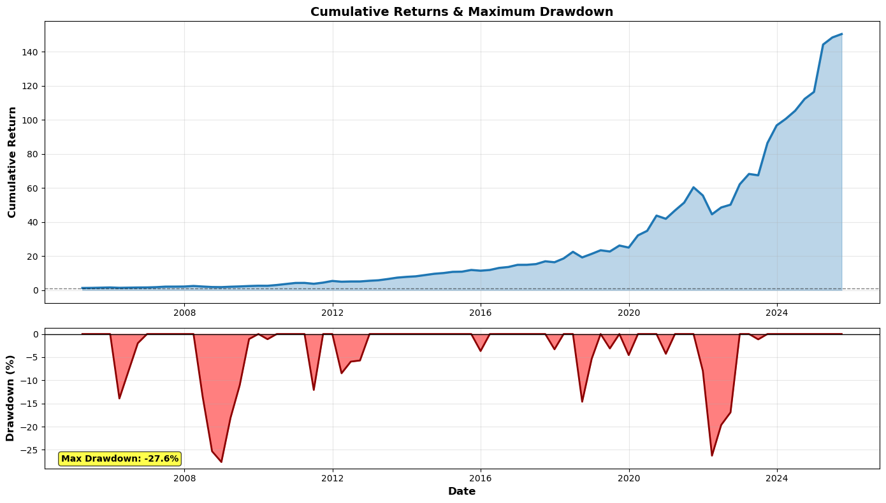
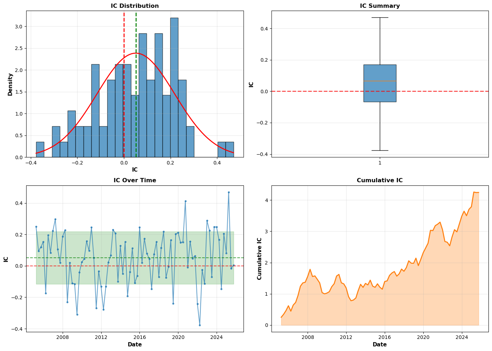
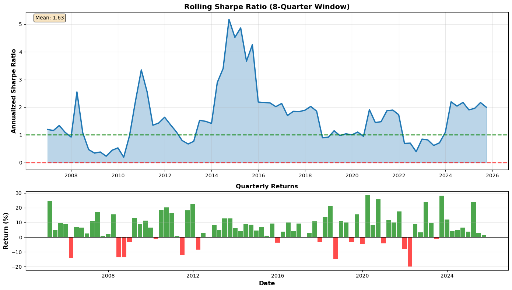
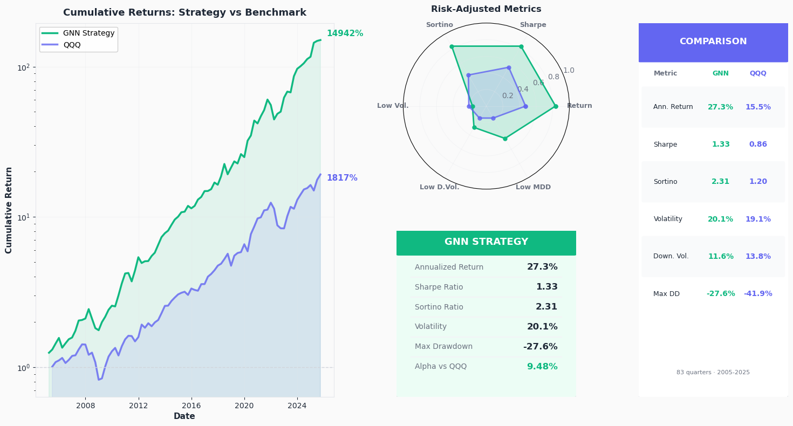
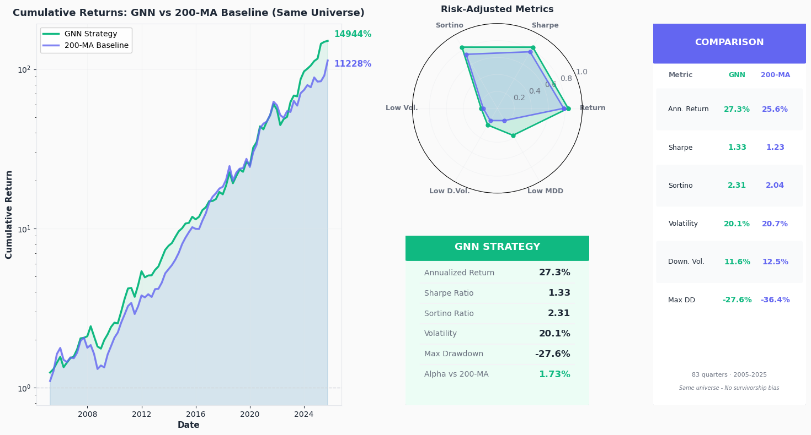

# Exploring Graph Neural Networks for Stock Prediction: My First Quant Project

A quantitative finance project exploring whether Graph Neural Networks can predict quarterly stock returns by modeling correlation relationships between S&P 500 stocks.

**Key Results:**
- **27.3% annualized returns** (2005-2025, 83 quarters)
- **Information Coefficient: 0.051** (t=2.77, p=0.007) - statistically significant predictive power
- **Sharpe: 1.33** | **Sortino: 2.31** | **Max Drawdown: -27.6%**



---

## Motivation

Can graph neural networks improve upon traditional momentum strategies and ML approaches by modeling stock relationships?

**Hypothesis:** Stocks don't move in isolation - they're influenced by correlations with peers, sectors, and market dynamics. GNNs can capture these relationships through correlation-based graphs where information propagates between connected stocks.

**Goal:** Build a strategy demonstrating statistically significant predictive power. Focus on modeling and validation, not production considerations (no transaction costs, position sizing, or execution details).

---

## Methodology

### Data & Features

**Sources:**
- Stock prices: Yahoo Finance (Current 100 tickers of Nasdaq100 (qqq), 2000-2025)
- Macro data: FRED (Treasury yields, VIX, USD/JPY, yield curve)

**Feature Types:**
- Price-based: OHLC, moving averages (5/20/50/200-day)
- Technical: Momentum, volatility, volume metrics, regime
- Market: QQQ closes and volatilities
- Macro: Treasury yields, VIX, currency rates
- Cross-sectional: Sector aggregates, correlation rankings

**Feature Selection:** Top 30 features per quarter selected by Spearman IC on training data only (no look-ahead bias).

**Target:** 3-month forward returns (non-overlapping quarterly returns).

---

### Graph Construction

Each quarter, build a dynamic correlation graph:

1. Calculate Spearman correlations on 10-year training window
2. Connect stocks with correlation ≥ 0.3 (threshold tested vs alternatives)
3. Node features: 30-dimensional scaled feature vectors
4. Result: ~500 nodes, ~50k-80k edges

Graph structure adapts to changing market regimes as correlations evolve.

---

### Model Architecture

**GNN (Graph Convolutional Network):**
```
Input (30 features)
  ↓
3x GCN Layers (64 hidden, BatchNorm, ReLU, Dropout 0.3)
  ↓
MLP Head (64 → 32 → 1)
  ↓
Output: Predicted 3-month return
```

- **Training:** Adam optimizer, ReduceLROnPlateau scheduler, early stopping
- **Loss:** SmoothL1Loss (robust to outliers)
- **Time:** ~15 min full backtest (RTX 4060)

---

### Walk-Forward Validation

Rigorous backtesting to ensure realistic performance:

- **Training period:** 2000-2005 (20 quarters minimum)
- **Test period:** 2005-2025 (83 quarters)
- **Process:** Train fresh model each quarter on expanding 10-year window
- **No look-ahead:** Features selected, scaled, and graph built on past data only

---

### Portfolio Construction

1. Generate predictions for all 100 stocks
2. **Volatility filter:** Remove top 25% most volatile (75th percentile cutoff)
3. **Positive only:** Consider stocks with predicted positive returns
4. **Top 10:** Select highest predictions, equal weight (10% each)
5. **Rebalance:** Quarterly (end Mar/Jun/Sep/Dec)

Volatility filter tested at multiple thresholds - 95th percentile optimal for risk-adjusted returns.

---

## Results

### Performance Metrics

| Metric | Value |
|--------|-------|
| Annualized Return | 27.3% |
| Sharpe Ratio | 1.33 |
| Sortino Ratio | 2.31 |
| Volatility | 20.1% |
| Max Drawdown | -27.6% |
| Total Return | 14,942% |

---

### Information Coefficient

| Metric | Value |
|--------|-------|
| Mean IC | 0.051 |
| Std IC | 0.168 |
| T-statistic | 2.77 |
| P-value | 0.007 |

**Interpretation:**  P-value proves this is statistically significant, not luck.



---

### Risk Analysis



Rolling Sharpe shows consistent risk-adjusted performance across bull markets (2009-2021), crashes (2020 COVID), and bear markets (2022).

---

## Baseline Comparisons

### 1. QQQ Benchmark (Contains survivarship bias)



- **Alpha: 9.48%** (t=2.80, p=0.005) - statistically significant
- **Survivorship bias:** GNN trained on stocks that survived to 2025, QQQ includes historical failures

---

### 2. 200-MA Momentum (Fair Comparison)

To address survivorship bias, tested against 200-day moving average strategy with **identical universe and filters**:

**200-MA Strategy:**
- Select stocks above 200-day MA
- Rank by % above MA (trend strength)
- Same volatility filter (95th percentile)
- Same portfolio (top 10, equal weight)



| Metric | GNN | 200-MA | Difference |
|--------|-----|---------|------------|
| Annualized Return | 27.3% | 25.6% | +1.7% |
| Sharpe | 1.33 | 1.23 | +0.10 |
| Sortino | 2.31 | 2.04 | +0.27 |
| Max Drawdown | -27.6% | -36.4% | **+8.8%** |
| Downside Vol | 11.6% | 12.5% | -0.9% |

**Statistical Test:**
- Alpha: 1.7% (t=0.37, p=0.71) - **not statistically significant**

**Interpretation:** GNN doesn't beat momentum on returns, but shows **superior risk management**: 24% lower max drawdown, 13% higher Sortino ratio. This suggests GNN captures complementary information, particularly avoiding correlated crashes.

---

## Key Findings

### What Worked
- **Statistically significant IC** - GNN has genuine predictive power (p=0.007)
- **Superior risk metrics** - Better drawdown control and downside protection than momentum
- **Volatility filtering critical** - 95th percentile dramatically decreased drawdowns, and lowered volatility
- **Graph structure adds value** - Captures relationships beyond simple price trends

### What Didn't
- **Alpha vs 200-MA not significant** - 1.7% alpha lacks statistical power with 83 quarters
- **High IC volatility** - Performance varies significantly across regimes
- **Survivorship bias inflates QQQ comparison** - Fair baseline comparison essential

---

## Limitations & Future Work

**Current Limitations:**
- No transaction costs (would reduce returns ~1%)
- Equal weighting suboptimal (could weight by confidence/volatility)
- 83 quarters insufficient for alpha significance vs strong baselines

**Future Improvements:**
- **Loss function:** Optimize IC directly (ranking loss) instead of absolute error
- **Attention mechanisms:** Learn which correlations matter most (GAT)
- **Fundamentals:** Add earnings, P/E ratios, analyst estimates
- **Regime detection:** Train regime-specific models or adaptive parameters
- **Longer backtests:** Extend to 1990s for more market cycles

---

## Project Structure
```
├── gnn_strategy.ipynb       # Main notebook: GNN training & QQQ benchmark, SURVIVORSHIP BIAS
├── benchmark.ipynb          # 200-MA comparison (survivorship-bias-free)    
└── visuals/                 # All charts
```

**Note:** `gnn_strategy.ipynb` created first with QQQ comparison. After recognizing survivorship bias, `benchmark.ipynb` implements fair 200-MA baseline on identical universe.

---

## Technical Details

**Parameters:**
- Training window: 10 years rolling
- Features: Top 30 by Spearman IC
- Graph threshold: 0.3 correlation
- Portfolio: Top 10 stocks
- Volatility filter: 95th percentile
- Rebalancing: Quarterly

**Stack:** PyTorch Geometric, pandas, numpy, sklearn, yfinance

**Hardware:** RTX 4060, ~15 min runtime

---

## Conclusion

This project demonstrates that GNNs can capture statistically significant predictive signal in stock returns (IC=0.051, p=0.007) by modeling correlation relationships. While the 1.7% alpha over momentum isn't statistically significant, the GNN achieves superior risk management with 24% lower maximum drawdown.

The project successfully tests whether graph-based deep learning can improve upon traditional momentum strategies and standard ML approaches - results suggest complementary value, particularly in risk mitigation.

**Key Takeaway:** GNNs don't replace momentum, but they capture different information that improves risk-adjusted returns through better drawdown control.

---


**Gergő Honyák**  Data Science & AI student
