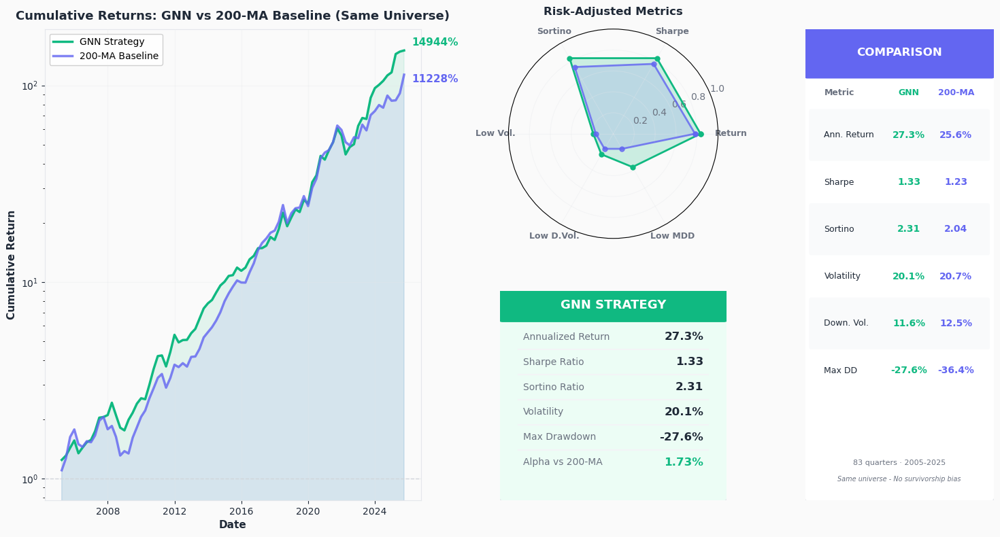

# Graph Neural Networks for Stock Prediction

**My first quant project: can a GNN predict quarterly Nasdaq-100 returns by modelling how stocks move together?**

Short answer: it finds a weak but statistically significant signal, and it does not beat a simple momentum baseline once the comparison is fair.

## Method

- **Data:** daily prices for the current Nasdaq-100 members (2000 to 2025) plus FRED macro series (yields, VIX, USD/JPY).
- **Features:** price, momentum, volatility, volume, sector and macro features. Each quarter the top 30 are chosen by Spearman IC on training data only.
- **Graph:** one node per stock, with an edge wherever the 10-year Spearman correlation is at least 0.3, rebuilt every quarter.
- **Model:** 3 GCN layers (64 hidden) and an MLP head, trained with SmoothL1 loss to predict the next 3-month return.
- **Walk-forward:** retrained every quarter on a rolling 10-year window, 83 out-of-sample quarters (2005 to 2025).
- **Portfolio:** drop the most volatile names, then hold the top 10 positive predictions equal weight, rebalanced quarterly.

## Results

| | GNN | 200-day MA momentum |
|---|---|---|
| Annualised return | 27.3% | 25.6% |
| Sharpe | 1.33 | 1.23 |
| Max drawdown | -27.6% | -36.4% |

- **Mean IC 0.051** (t = 2.77) across 83 quarters. The signal is real but noisy (IC standard deviation 0.168).
- **Alpha over the momentum baseline: 1.7% a year, t = 0.37.** Not significant. The smaller drawdown is the only clear difference.
- The 9.5% alpha against QQQ is not meaningful: the universe is today's winners, while QQQ held the stocks that later dropped out.

## What I would do differently

- **Survivorship bias.** Using current constituents inflates every absolute number above. Point-in-time index membership is the fix.
- **Threshold chosen on the test period.** The volatility cut-off was picked by comparing thresholds over the same 2005 to 2025 period, which is a mild form of overfitting.
- **No transaction costs** are modelled.
- **Wrong loss.** The portfolio only uses the ranking, so a ranking loss would match the goal better than predicting the return itself.

## Files

- `gnn_strategy.ipynb`: GNN training, walk-forward and QQQ comparison
- `benchmark.ipynb`: 200-day MA baseline on the identical universe and filters

**Stack:** PyTorch Geometric · pandas · NumPy · scikit-learn · yfinance
