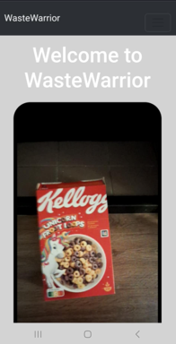
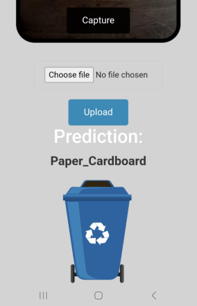

# Gergő Honyák — Project Portfolio

Third-year Applied Data Science & AI student at Breda University of Applied Sciences, starting a Data Science & AI pre-master at TU/e in September. I like finding patterns in data and building the whole thing around them — not just training a model, but the pipeline, the app, and the honest evaluation that tells you whether it actually works.

Most of my recent work points at **quantitative finance**: strategy research, backtesting, risk, and live market tooling. Alongside that I've built computer-vision, NLP, and MLOps projects across my degree. This repo collects the ones I'm happy to be judged on.

---

## Featured projects

### [SwingLab](swinglab)
A research platform, backtester, and live monitor for a combined mean-reversion + momentum book — run with real capital. FastAPI + React, with a full stress-test suite (walk-forward, crisis periods, block-bootstrap Monte Carlo, parameter sensitivity).

### [Graph Neural Networks for Stock Prediction](GNN%20project)
My first quant project: can a GNN predict quarterly Nasdaq-100 returns by modelling the correlation graph between stocks? Statistically significant predictive power (IC 0.051, t = 2.77, p = 0.007) over an 83-quarter walk-forward, validated against Fama-French factors.

### [Sentify — Emotion-Classification MLOps Pipeline](sentify-emotion-pipeline)
A team, production-style MLOps system for Banijay Benelux: video/audio → transcript with per-sentence emotion. Fine-tuned BERT (F1 0.41 → 0.84 with focal loss), served from a Docker Compose stack (FastAPI · React · Streamlit · MLflow · Postgres · MinIO) with Azure ML training and an Airflow retraining loop.

### [money_dashboard](money-dashboard)
A live market-analytics terminal — sector breadth and rotation, the full volatility complex (term structure, VVIX, SKEW, variance risk premium, dispersion), macro & regime (yfinance + FRED), and options positioning, across six pages driven by a market-session clock.

### [NPEC — Root Analysis, Robotics & Inpainting Research](npec-root-analysis)
Two connected pieces of work with the Netherlands Plant Eco-phenotyping Centre: an end-to-end pipeline (U-Net segmentation → skeletonize → Dijkstra → sub-millimetre PID/RL robot inoculation) and a research study on repairing gaps in root masks (BCE U-Net winner, validated with Wilcoxon tests at p < 0.001 across 9,014 patches).

### [Waste Warrior](waste-warrior)
A deep-learning waste classifier wrapped in a full Flask app: MobileNet transfer learning to 97.7% accuracy, with Grad-CAM / LIME / integrated-gradients explainability to confirm the model looks at the object, not the background.

---

## What I work with

**Languages** — Python, SQL, JavaScript

**ML / DL** — PyTorch, TensorFlow/Keras, scikit-learn, Transformers, PyTorch Geometric

**Quant** — pandas, NumPy, SciPy, yfinance, backtesting & stress-testing, Robert Carver-style systematic design

**MLOps / Infra** — FastAPI, Docker, MLflow, Airflow, Postgres, Azure ML, GitHub Actions

**Frontend** — React, Vite

## A bit more

I got into quant after reading Marcos López de Prado's *Advances in Financial Machine Learning*, and I've since competed solo in **IMC Prosperity 4** (223rd of ~18,800 teams; 1st in the Netherlands on the manual round). I'm open to quant research / trading and data science internships in Amsterdam.

Each project folder has its own detailed README with figures. Have a look around.
