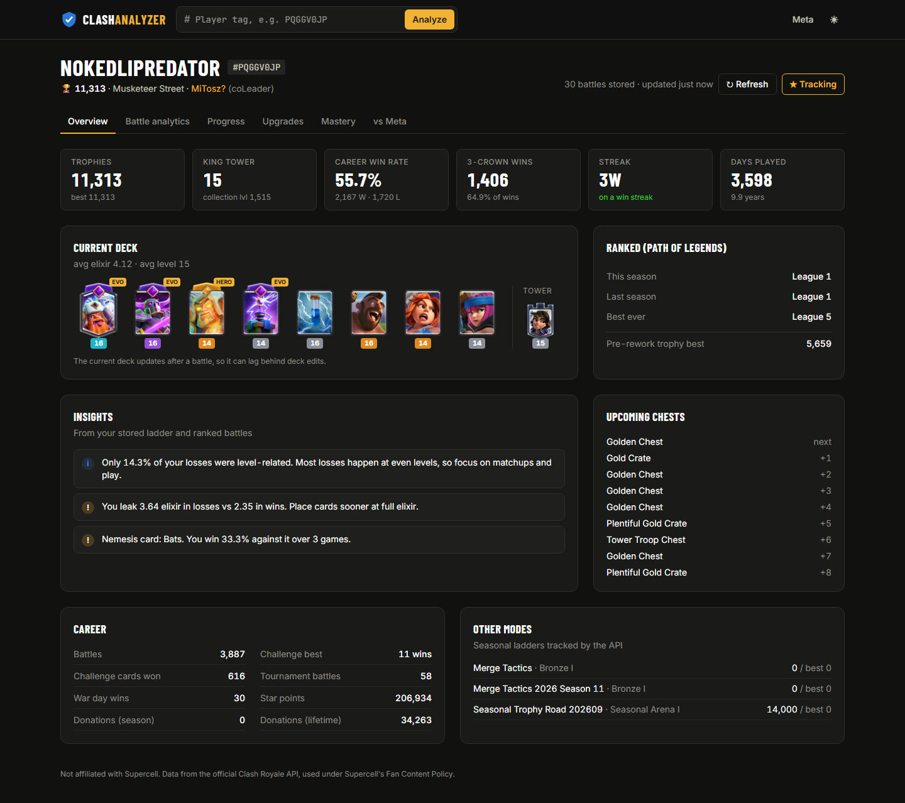
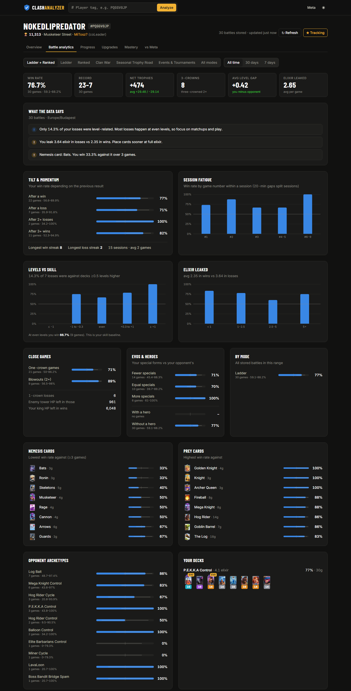
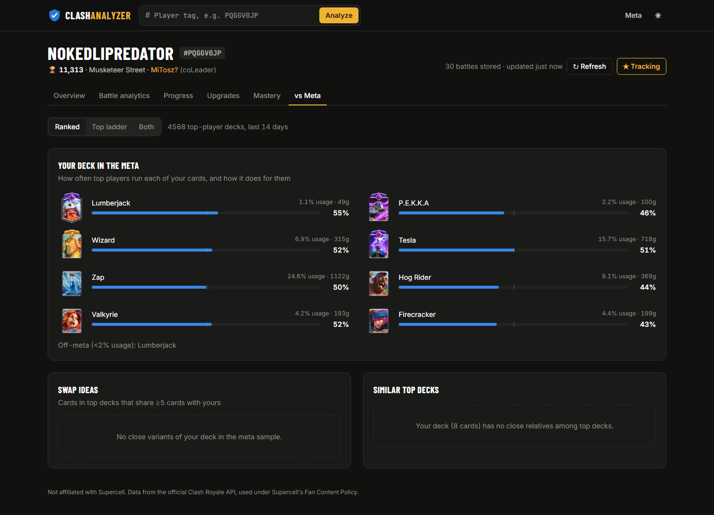

# Clash Analyzer

**A Clash Royale progress tracker, upgrade planner, battle-analytics dashboard and meta comparison, built on the official Clash Royale API.**

➡️ **Code, setup and API docs: [github.com/honyakgergo/clash-analyzer](https://github.com/honyakgergo/clash-analyzer)**

---

## Why I built it

The official API has no memory. The battlelog only keeps the last ~30 games, and a profile only shows its current state. Clash Analyzer polls tracked players in the background and stores every battle and a profile snapshot in SQLite, so history builds up over time. Then it computes what the game never shows you, with the same statistical care I use in my quant work. **Every rate has a 95% Wilson interval, and an insight only appears once the sample is large enough to support it.**

## Battle analytics

- **Tilt detection:** win rate after a win, after a loss, and after 2+ losses in a row.
- **Session fatigue:** win rate by game number within a session.
- **Levels vs skill:** win rate by card-level gap, and the share of losses where you were underleveled.
- **Elixir leaked**, **close games vs blowouts**, **Evo / Hero advantage**.
- **Nemesis and prey cards**, **opponent archetypes**, and the best hour and weekday to play.
- **Plain-English insights** generated from all of the above.

## Progress and upgrades

<table>
<tr>
<td width="50%"></td>
<td width="50%"></td>
</tr>
</table>

A trophy path rebuilt from every stored battle, with snapshot trends and day/week deltas. The upgrade planner works out the gold and copies needed to bring your deck to level 13–16, which played cards can be upgraded now (cheapest first), and how your card levels compare to your opponents'. The API doesn't expose upgrade costs, so the cost table is maintained by hand and checked against the published totals in tests.

## Meta comparison

<table>
<tr>
<td width="50%"></td>
<td width="50%"></td>
</tr>
</table>

A daily crawl of the top 100 Path of Legends players' battlelogs gives card usage and win rates, archetypes and top decks. The **vs Meta** tab shows how each of your cards performs at the top, which top decks are similar to yours, and swap ideas. A clan page shows member activity, donations and the live river race.

## Stack

| | |
|---|---|
| Backend | Python 3.12, FastAPI, async httpx (TTL cache, throttle, retry), SQLModel on SQLite, APScheduler, uv |
| Frontend | Vite, React 19, TypeScript (strict), Tailwind v4, Recharts, TanStack Query |
| Quality | pytest (112 tests, 95% coverage, against recorded real API responses), ruff; Vitest + Testing Library, oxlint, tsc |

---

Not affiliated with, endorsed, sponsored or specifically approved by Supercell. See Supercell's Fan Content Policy.
