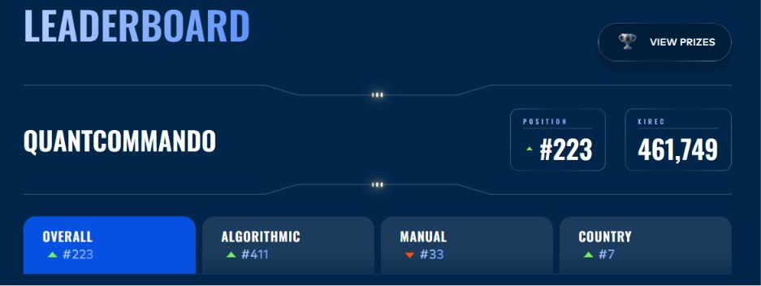

# IMC Prosperity 4 solo entry

**A global trading competition, 223rd of 18,800 teams solo, 1st in the Netherlands on the manual round.**

Solo · Competition · Algorithmic trading · 2026 · Complete

| of 18,800 teams | Netherlands, overall | Manual round |
|---|---|---|
| **223rd** | **7th** | **1st NL** |

---

A global algorithmic trading competition run across timed rounds, mixing an algo trading challenge with separate manual reasoning puzzles each round. I competed solo, against roughly 18,800 teams and over 30,000 participants total, finishing 223rd overall, 7th in the Netherlands overall, and 1st in the Netherlands on the manual challenges (33rd globally).

On the algorithmic side, work centered on pricing voucher options, estimating implied volatility and fitting it to a smile across strikes, then converting deviations from that smile into cross-sectional z-scores to flag mispriced vouchers. A market-making layer balanced quote competitiveness against inventory risk, with a regime-detection layer adjusting behavior as the simulated market's conditions shifted mid-round.

Round 3 was humbling: an overfit algorithm looked incredible on the backtest and fell apart the moment live data arrived. From then on I optimized for strategies that were theoretically sound rather than ones that simply scored highest on a historical curve, which is what drove the results in rounds 4 and 5. For the manual rounds, the assumption was that most competitors would paste the problem into an LLM and run with the first answer, so instead of optimizing for the textbook-correct answer, I modeled what the crowd's likely solution would be and worked out where the real edge sat once everyone else had clustered around it. Against other humans, thinking about what they'll do beats pure optimization.

**Stack:** `Python` · `NumPy` · `pandas`
