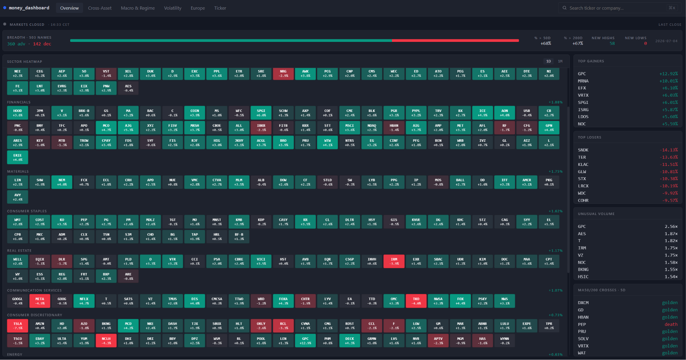
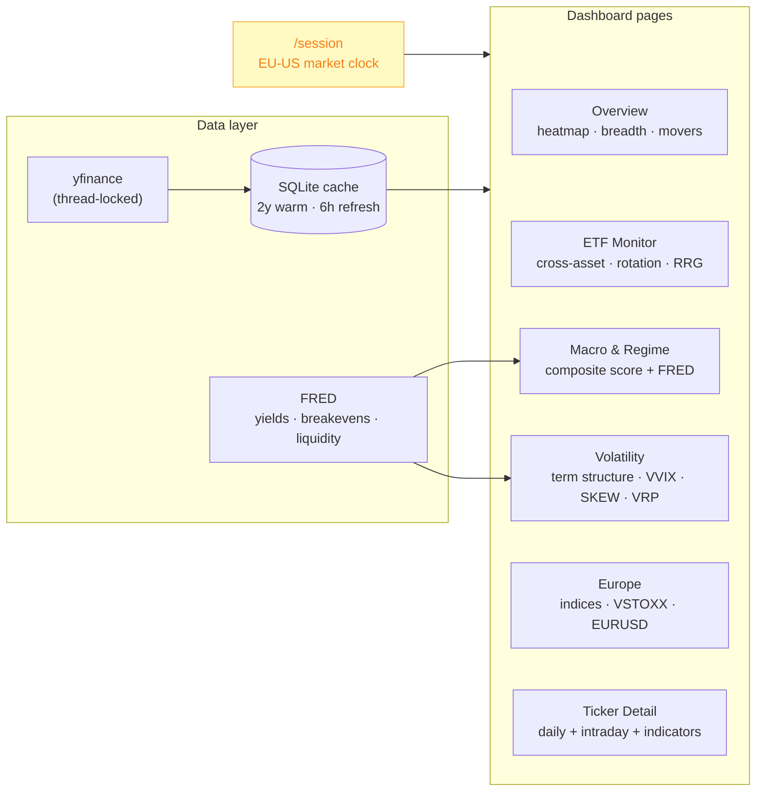
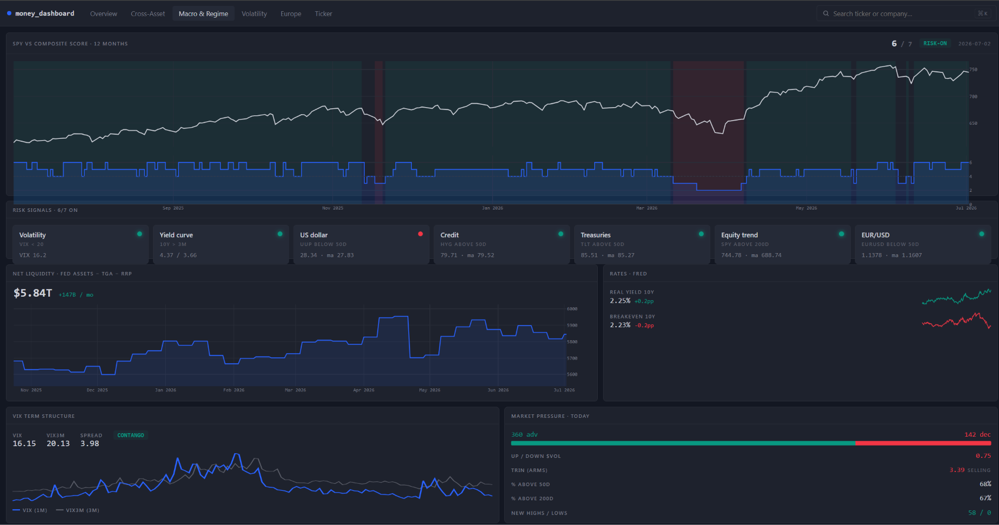
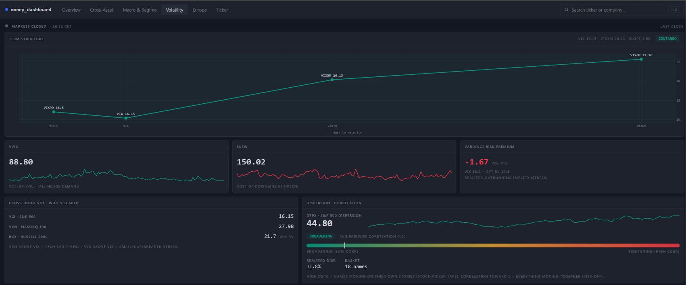

# money_dashboard

**A live market-analytics terminal — the screen I keep open while the market is running.**

money_dashboard is a real-time cockpit for reading the market: sector breadth and rotation, the volatility complex, macro and regime, and options positioning, all in one place. It's deliberately **not** a backtester — the strategy research lives in [SwingLab](../swinglab). This is the tool for *situational awareness*: what's moving, what's stressed, and what the option market is pricing, right now.

Everything is driven by a **market-session clock** (EU/US), so each page knows whether it's pre-market, in the cash session, or closed, and refreshes accordingly. Data is ~15-minute delayed and always labelled as such — no pretending it's a live feed.

## The six views

**Overview** — a sector heatmap, market **breadth** (advancers/decliners and proxies), and the day's movers: the fastest read on whether the whole tape is risk-on or narrow.

**ETF Monitor** — a cross-asset board (equities, bonds, commodities, FX, crypto) with relative performance and a **Relative Rotation Graph (RRG)** to see which sectors are leading, weakening, or improving.

**Macro & Regime** — a composite macro score blending yfinance market data with **FRED** series (real yields, breakevens, net liquidity), plus a rule-based Bull/Bear/Sideways regime.

**Volatility** — the part I'm proudest of: a full vol cockpit with the **VIX term structure** (contango/backwardation), **VVIX**, **SKEW**, cross-index comparison, the **variance risk premium**, and a **dispersion** read. It's meant to answer "how stressed is the market, and is that stress in the index or the single names?"

**Europe** — EU indices, **VSTOXX**, EURUSD, and the US/EU **session overlap**, since I trade European names too and the cash-session overlap is when things actually move.

**Ticker Detail** — per-name daily history with MA(50/200), Bollinger, z-score, RSI, ATR, and regime, plus on-demand **intraday**, and an **options-as-indicator** panel: put/call ratio, IV rank, skew / risk-reversal, and an approximate **GEX** (gamma exposure).

## How it works

### Backend — FastAPI
A clean set of endpoints, each backing one surface: `/overview`, `/etf-monitor`, `/macro` + `/macro/extended`, `/vol`, `/europe`, `/ticker/{t}`, `/intraday/{t}`, `/options/{t}`, and `/session`. Each heavy endpoint supports a `force` refresh and is otherwise served from cache.

### Data layer
Prices come from **yfinance** through a thread-locked wrapper into a **SQLite** OHLCV cache. On startup the app seeds its search index from CSVs, warms ~2 years of data for the full universe in the background, then refreshes every six hours. A **flag-and-keep** data-quality layer marks suspect bars rather than silently dropping them, so a bad print is visible instead of hidden. Macro adds **FRED** on top for the series yfinance can't give.

### Frontend — React
A six-page React/Vite app on a TradingView-style dark palette, with a shared ticker search (symbol or name) that validates unknown symbols against the live pipeline before adding them.

## Stack

`Python` · `FastAPI` · `pandas` / `NumPy` · `yfinance` · `FRED API` · `SQLite` · `React` · `Vite`

## Why I built it

I wanted one screen that answered "what kind of day is it?" without me tab-hopping between a dozen sites. Breadth, rotation, the vol surface, and macro in one place — and building it meant actually understanding each of those indicators well enough to compute them from raw data, which was the real point.
