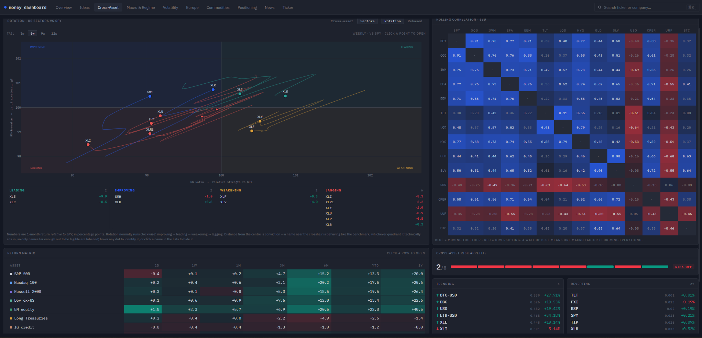

# money_dashboard

**The market-monitoring terminal I read every trading day: what is moving, what is stressed, what options are pricing, and who is holding the trade.**

It is deliberately not a backtester. It is how I learn the market: I form a view of the day from these numbers, then work out the odd parts, like why credit is widening while equities hold.

## Pages

- **Overview:** sector heatmap and breadth across ~500 names (% above the 50- and 200-day, new highs and lows, TRIN).
- **Cross-Asset:** a Relative Rotation Graph against SPY, a rolling correlation matrix and a risk-appetite score.
- **Macro and regime:** a composite score from market data and FRED (real yields, breakevens, net liquidity).
- **Volatility:** term structure, VIX/VIX3M, realised-vol cone, variance risk premium, VVIX, SKEW and dispersion, each shown with its 1-year percentile.
- **Commodities:** roll yield (futures ETF against the front contract), ratios with 5-year percentiles, gold against the real yield, seasonality.
- **Positioning:** CFTC Commitments of Traders by trader type, the NAAIM exposure index and AAII sentiment, each with history and a percentile.
- **Ticker:** full price history, fundamentals, earnings, analyst targets, short interest and options signals (IV rank, skew, approximate gamma exposure).

## Design choices

- **Levels come with context.** A number is shown with its percentile or z-score, because VIX 18 means different things in different years.
- **Missing data stays missing.** Anything the free feed does not serve is marked unavailable, and proxies are labelled as proxies.
- **Data is ~15 minutes delayed,** and every page says so.

**Stack:** Python · FastAPI · pandas · yfinance · FRED · SQLite · React · Plotly · lightweight-charts
