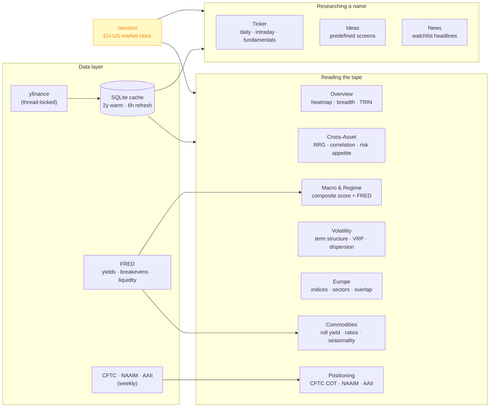
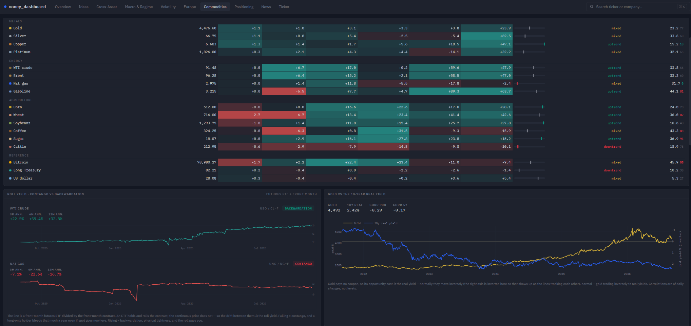
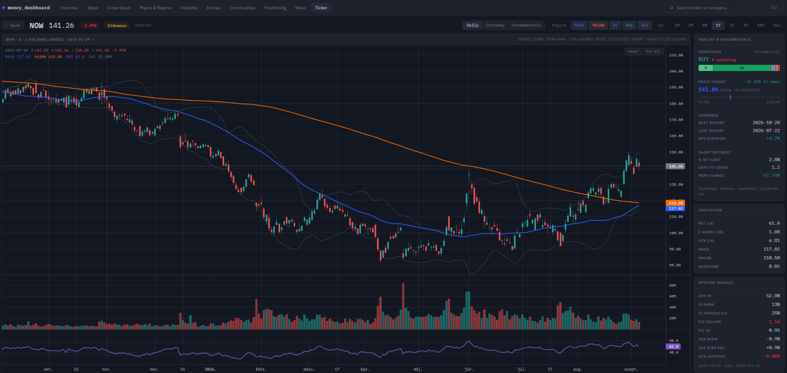

# money_dashboard

**A live market-analytics terminal — the screen I keep open while the market is running.**

money_dashboard is a real-time cockpit for reading the market: sector breadth and rotation, the volatility complex, macro and regime, commodities, weekly positioning, and per-name research, all in one place. It's deliberately **not** a backtester — the strategy research lives in [SwingLab](../swinglab). This is the tool for *situational awareness*: what's moving, what's stressed, what the option market is pricing, and who is actually holding the trade.

Everything is driven by a **market-session clock** (EU/US), so each page knows whether it's pre-market, in the cash session, or closed, and refreshes accordingly. Data is ~15-minute delayed and always labelled as such — no pretending it's a live feed.

## Why I built it, and what it's actually for

I wanted one screen that answered "what kind of day is it?" without tab-hopping between a dozen sites. But the reason it earns its keep is that **it is how I learn the market.**

I read it every morning and through the session, form a view of what kind of day it is, and then talk the odd parts through with Claude — why is credit widening while equities hold, why is the vol curve backwardated on a green day, why is copper leading. Having the actual numbers in front of me while I ask means the answer lands on something concrete instead of staying abstract, and doing that daily has given me a far clearer picture of how the pieces move together than reading market commentary ever did.

Building each indicator from raw data was the other half of the same lesson: you cannot compute TRIN, a variance risk premium, a roll yield or an RRG without understanding exactly what it claims to measure and where it breaks.

The second job is **research on a specific trade** — the Ticker page, where fundamentals, earnings, analyst opinion, news and the option surface sit next to the price chart, so a name can be checked before I take it rather than after.

## The pages

```mermaid
flowchart LR
    SESSION["/session<br/>EU-US market clock"]:::clock

    subgraph TAPE["Reading the tape"]
        OV["Overview<br/>heatmap · breadth · TRIN"]
        XA["Cross-Asset<br/>RRG · correlation · risk appetite"]
        MACRO["Macro & Regime<br/>composite score + FRED"]
        VOL["Volatility<br/>term structure · VRP · dispersion"]
        EU["Europe<br/>indices · sectors · overlap"]
        CMD["Commodities<br/>roll yield · ratios · seasonality"]
        POS["Positioning<br/>CFTC COT · NAAIM · AAII"]
    end

    subgraph NAME["Researching a name"]
        TICK["Ticker<br/>daily · intraday · fundamentals"]
        IDEAS["Ideas<br/>predefined screens"]
        NEWS["News<br/>watchlist headlines"]
    end

    subgraph DATA["Data layer"]
        YF["yfinance<br/>(thread-locked)"]
        FRED["FRED<br/>yields · breakevens · liquidity"]
        CFTC["CFTC · NAAIM · AAII<br/>(weekly)"]
        CACHE[("SQLite cache<br/>2y warm · 6h refresh")]
    end

    SESSION --> TAPE
    SESSION --> NAME
    YF --> CACHE --> TAPE
    CACHE --> NAME
    FRED --> MACRO
    FRED --> CMD
    CFTC --> POS

    classDef clock fill:#fff9c4,stroke:#f9a825,color:#f57f17;
```

**Overview** — sector heatmap with a US / Europe / Commodities switch, market **breadth** (advancers, % above the 50- and 200-day, new highs/lows, **TRIN**) across ~500 names, and the day's movers. The fastest read on whether the tape is broadly risk-on or a narrow handful of names.

**Cross-Asset** — the hero panel is a **Relative Rotation Graph**. Both axes are measured against SPY and centred on 100, so the crosshair *is* the benchmark: x is relative strength, y is whether that strength is still building, and the four quadrants are leading, weakening, lagging and improving. Rotation normally runs clockwise, distance from the centre is conviction, and the tail shows how a name got where it is. Both axes are z-scored against each member's own two-year history before being re-centred — without that, every series clusters within a hair of 100 and the chart collapses to a dot. Beside it: a rolling correlation matrix (a wall of blue means one macro factor is driving everything), a return matrix, and a cross-asset risk-appetite score.

**Macro & Regime** — a composite macro score blending market data with **FRED** series (real yields, breakevens, net liquidity), plus a rule-based Bull/Bear/Sideways regime.

**Volatility** — built on the principle that a vol level means nothing on its own (VIX 18 is calm in 2022, a warning in 2017), so every gauge carries its **1-year percentile** and the page opens with a regime verdict assembled from those percentiles:

- **term structure** and **VIX/VIX3M** over time — above 1 is backwardation, the most reliable single tell that a drawdown is under way rather than over
- **realized-vol cone** — SPY realized vol at 5/10/21/63 days against its 3-year 10–90th percentile bands, with VIX overlaid. Above the band and the index really is moving unusually for that horizon; inside it and it's ordinary, whatever the headlines say
- **VRP** (VIX − 21d realized) — the premium vol sellers harvest, which goes sharply negative exactly when that trade stops working
- **VVIX · SKEW · cross-index** (VIX / VXN / RVX) — tech-led and breadth-led stress are different problems
- **dispersion** — rolling average pairwise correlation of a mega-cap basket, plus single-name IV vs index IV with an implied-correlation proxy

**Europe** — EU indices with intraday paths, EU sector ETFs with a rebased chart and ranking, EUR crosses, an EU realized-vol gauge, and the 15:30–17:30 CET **US/EU overlap**, which is when things actually move.

**Commodities** — organised around what a commodity can actually tell you:

- **roll yield** — contango vs backwardation, measured as a front-month futures **ETF ÷ front-month contract**. An ETF holds and rolls the contract; the continuous price does not, so their drift *is* the roll yield. This is the fact a price chart hides: spot can rally all year while a long-only holder bleeds to the roll
- **ratios** — gold/silver, copper/gold, gold/oil, crude/gas, each with a **5-year percentile**, which is what turns a level into "stretched"
- **gold vs the 10-year real yield** — gold pays no coupon, so its opportunity cost *is* the real yield; the right axis is inverted so the normal inverse relationship reads as the lines tracking, and decoupling becomes obvious
- **seasonality** — average return by calendar month over 10 years with the hit rate, the one asset class where this is physical: heating demand, harvests, driving season

**Positioning** — the weekly half of the picture, and the part that tells you *who is holding the trade*.

From the CFTC's **Commitments of Traders**: the Traders in Financial Futures report gives net positioning for the **asset-manager**, **leveraged-fund** and **dealer** categories in E-mini S&P 500, E-mini Nasdaq-100, the 10-year T-Note and Euro FX; the Disaggregated report gives **managed money**, **producer** and **swap dealer** net in gold, silver, copper and WTI crude. Each leg carries ~3 years of weekly net history plus a percentile, because a net-long number only becomes information once you know whether it's an extreme. Contracts are resolved from each report by **highest open interest among name matches**, not by exact string — CFTC contract names are verbose and shift, and matching on them breaks silently.

On top of that: the **NAAIM Exposure Index** (a weekly survey of how much equity risk active managers are actually carrying) and **AAII** bull/neutral/bear retail sentiment. Both are accumulated into a local SQLite table so the history grows week over week — AAII's full historical export is membership-gated, so the series is built forward from the ~22 weeks the public page exposes.

**Ticker** — where a trade gets checked before I take it. Three modes:

- **Daily** — price on **TradingView's own `lightweight-charts`**, so the interactions are the real ones. The chart loads the instrument's **entire history once per ticker** (SPY: 8,456 bars back to 1993); the period buttons only move the *visible window* and never refetch, which is the difference between a chart you can explore and one you can only look at. Click a candle to set an entry and a later one for an exit and the analyser reports return, days held, annualised, max drawdown and max run-up. MA50/200, Bollinger, volume and RSI panes, optional regime shading and analyst targets.
- **Intraday** — 1m…60m bars with session VWAP and the same entry/exit analyser.
- **Fundamentals** — revenue and net income **with price overlaid**, valuation multiples with percentile-vs-own-history, and a trailing P/E band.

Side rail: analyst **consensus and price targets**, **earnings** dates with the last EPS surprise, **short interest**, indicators, and **options-as-indicator** — ATM IV, IV rank and percentile, put/call, 25Δ skew and risk reversal, and an approximate **GEX**.

**Ideas** — Yahoo's predefined screens (gainers, losers, most active, value, growth, small caps) as a discovery surface.

**News** — deduped, newest-first headlines across the watchlist, and per-ticker on the research page.

## How it works

### Backend — FastAPI
One thin route per surface (`/overview`, `/etf-monitor`, `/macro`, `/vol`, `/europe`, `/commodities`, `/cot`, `/sentiment`, `/screener`, `/ticker/{t}`, `/intraday/{t}`, `/options/{t}`, `/analysis/{t}`, `/fundamentals/{t}`, `/news`, `/session`), with all logic in `services/`. Every builder is `build_x(force=False) -> dict`, wraps its work in a TTL cache keyed on live/close mode, and returns `mode`, `phase` and `as_of` alongside its payload. Any endpoint accepts `?force=true`.

### Data layer
Prices come from **yfinance** through a **process-wide lock** (yfinance is not thread-safe and concurrent downloads corrupt data) into a **SQLite** OHLCV cache. On boot the app seeds its search index from CSVs and warms ~2 years for the whole universe in a background thread, then refreshes every six hours. A **flag-and-keep** data-quality layer marks suspect bars rather than dropping them, so a bad print is visible instead of hidden.

The subtlety worth knowing: two accessors read the same table but hand back a **different last bar**, because two callers need opposite things. Pages that overlay a live intraday snapshot need the last cached bar to still be the *previous* close — it's the denominator of a 1-day return whose numerator is a separate live price, and giving them today's forming bar measures the live price against itself. Charts and level readouts need the opposite: there, the last bar simply *is* the current price. So the forming bar is filtered **on read**, never on write, and the trimmed view is the default — which makes a forgetful caller correct instead of quietly wrong. Both mistakes have happened: a whole heatmap of `+0.0%`, which reads as a dead-calm market rather than a bug, and BTC-USD showing 77,300 while it traded at 81,594. `backend/check_bar_contract.py` asserts the invariant.

Freshness is measured as *"when did we last ask"* (`refreshed_at`), not *"how old is the last bar"* — judging by bar date means guessing which session should exist by now, and that guess is wrong on weekends, on holidays, before a market's open, and on every non-US calendar.

Macro adds **FRED** on top for the series yfinance can't give — fetched over `requests` with certifi CAs rather than `fredapi`, which fails on this machine because it verifies against a Windows certificate store holding one malformed cert. yfinance was never affected, which is why prices worked while every FRED panel sat silently blank.

### Frontend — React
A React/Vite app on a TradingView-style dark palette, with a shared ticker search (symbol or name) that validates unknown symbols against the live pipeline before adding them. Price charts use `lightweight-charts`; everything else uses Plotly.

## Conventions

- **Missing data is absent, never faked.** Services probe what the feed serves and omit what it doesn't; the frontend renders an explicit "unavailable" note. Proxies (IWM realized vol standing in for the effectively-delisted `^RVX`, the implied-correlation approximation, ETF-based roll yield) are labelled as proxies wherever they surface.
- **Levels ship with context.** Prefer `(level, percentile, z-score)` over a bare number.
- **Sorting must be zero-safe.** `b[metric] || -99` coerces a legitimate `0` to `-99` — a real bug on the Overview heatmap once.
- **Colour semantics:** `> 0` bull, `< 0` bear, exactly `0` neutral.

## Known constraints

- The feed is delayed ~15 minutes and every live surface says so.
- **IV rank matures over time.** `options_iv.db` snapshots ATM IV daily and cannot be backfilled — the rank is meaningless for the first few weeks, and says so.
- The session clock is weekend-aware but only partially holiday-aware (US holidays hardcoded through 2026).
- Options data is fetched per chain and is slow; anything needing many chains gets its own endpoint and a long TTL.

## Stack

`Python` · `FastAPI` · `pandas` / `NumPy` · `yfinance` · `FRED` · `CFTC Socrata` · `SQLite` · `React` · `Vite` · `Plotly` · `lightweight-charts` · `zustand`
