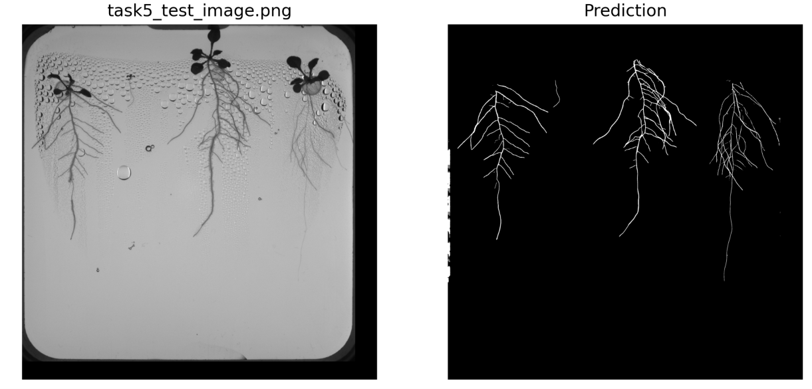
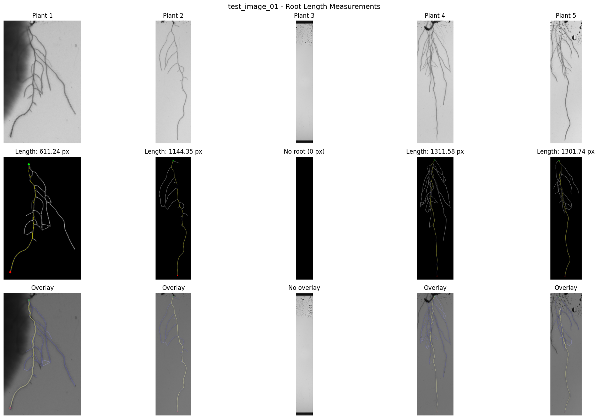
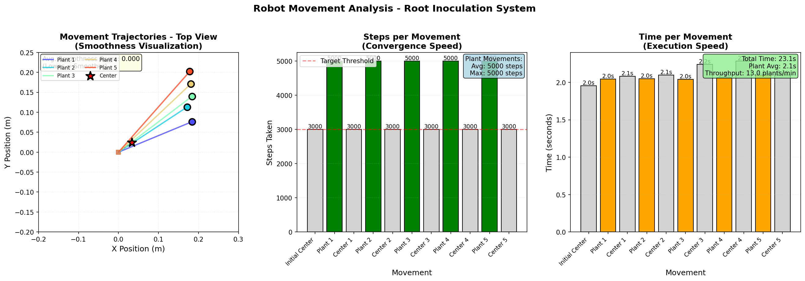
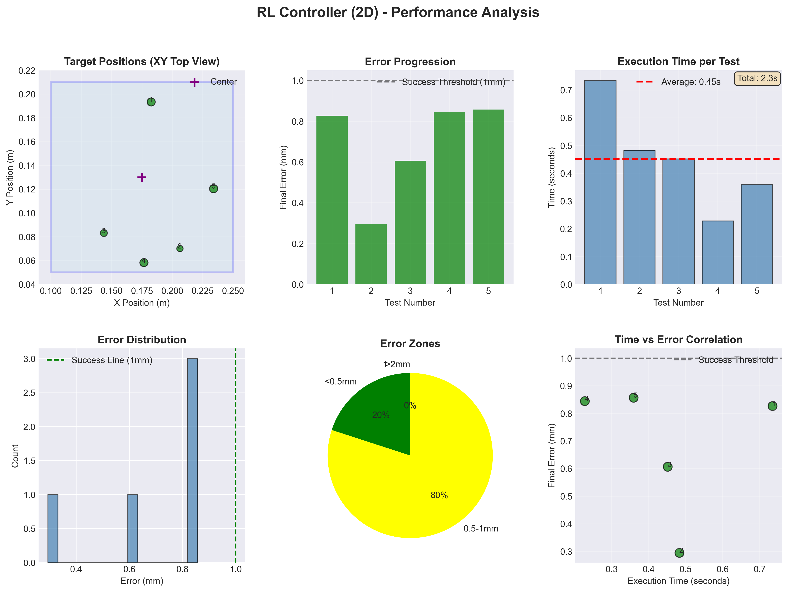
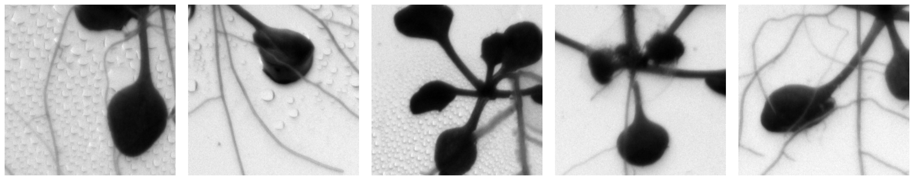
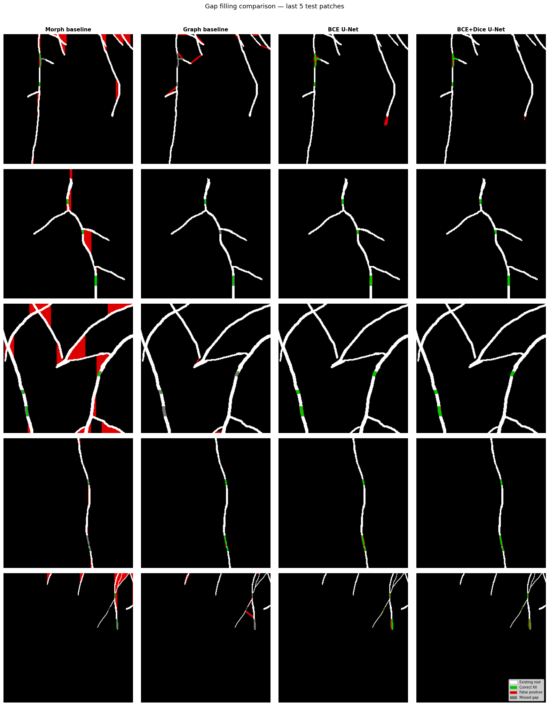
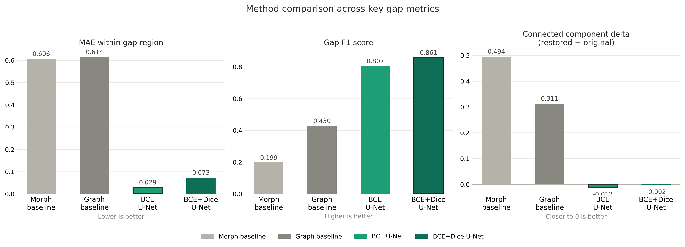

# NPEC — Root Analysis, Robotics & Inpainting Research

Two connected pieces of work done with the **Netherlands Plant Eco-phenotyping Centre (NPEC, Utrecht)** on *Arabidopsis* root phenotyping:

1. **An end-to-end pipeline** — predict a plant's root system from a raw plate photo, measure it, and use that to drive a robot arm that automates inoculation.
2. **A research study** — can a learned model repair the gaps that segmentation leaves in a root mask, and does it beat classical image processing?

---

## Part 1 — Segmentation → measurement → robotic inoculation

Three separate problems chained into one working pipeline. Each had to actually work before the next made sense.

```
plate photo → U-Net segmentation → skeletonize → Dijkstra root tip
           → pixel→robot transform → PID control → drop inoculum
```

### Segmentation
A **4-class U-Net** (background, root, seed, shoot) runs patch-based inference (256×256 patches) over the full 2912×2912 plate images, then morphological cleaning and component filtering isolate the thin, branching root from a noisy background of condensation, plate edges, and shadows.

<p align="center">
  
</p>

### Measurement
Rather than a crude pixel count, root length is measured by **skeletonizing** the mask and running **Dijkstra pathfinding** from the root tip down its longest branch — which also gives the exact tip coordinate the robot needs.
<p align="center">
  
</p>

### Robotic inoculation
The tip coordinate is transformed from pixel space into the OT-2 robot's coordinate space, and a **PID controller** drives the arm to it and drops inoculum, then returns to center for the next plant (~5 plants per batch).

<p align="center">
  
  
</p>

The tuned PID controller (Kp `[3.5, 3.5, 140]`, Ki `[0.1, 0.1, 0.01]`, Kd `[0.5, 0.5, 5]`) holds **sub-millimetre precision** — final positioning error stayed under 1 mm across all five targets, with smooth motion and no overshoot.

<p align="center">
  
</p>

I also trained a **reinforcement-learning controller** (SAC/PPO, starting from the PID baseline) as an alternative approach to the same reach-and-place task.

<p align="center">
  
</p>

---

## Part 2 — Root-gap inpainting research

Segmentation masks are never perfect: they leave **gaps** in the root, and those gaps corrupt any length measurement taken afterwards. The research question was whether a learned model can fill those gaps better than classical morphology — and, specifically, whether it works on *Arabidopsis*, which no prior inpainting work had targeted.

<p align="center">
  
</p>

**Setup.** A literature review (~20 references — Chen et al. 2018/2019, Xie et al. 2025, Ronneberger et al. 2015) framed three formal hypotheses. EDA on the full NPEC dataset showed only ~9% of patches passed the root-coverage filter, which drove a decision to lower the threshold and expand the dataset. Gaps were generated synthetically, and the train/val/test split was done at the source-image level to prevent leakage.

**Methods compared.** Two U-Net variants (BCE and Dice loss) against two classical baselines (morphological closing and a graph-based method), evaluated with three gap-region metrics from Chen et al. 2018: **gap MAE, gap F1, and connected-component (CC) delta.**

<p align="center">
  
</p>

**Findings.** Shapiro-Wilk confirmed non-normal distributions, so significance was tested with **Wilcoxon signed-rank tests + Bonferroni correction** and bootstrap 95% CIs. All six pairwise comparisons rejected their null hypotheses at **p < 0.001 across 9,014 test patches.** The **BCE U-Net** was the clear winner across all three metrics and was selected as the representative model.

<p align="center">
  
</p>

Results were written up and presented on an A0 poster with colour-coded overlays (green = correct fill, red = false positive, grey = missed gap).

📄 **[Research poster (PDF)](research_poster.pdf)**

**Limitations** acknowledged up front: synthetic training gaps, the *Arabidopsis* domain gap, and 2D-projection artifacts.

---

## Stack

`PyTorch` · `U-Net` · `OpenCV` · `scikit-image` (skeletonization) · `Dijkstra pathfinding` · `Stable-Baselines3` (SAC/PPO) · `PyBullet` (OT-2 simulation) · `SciPy` (Wilcoxon, bootstrap) · `NumPy` · `Matplotlib`
