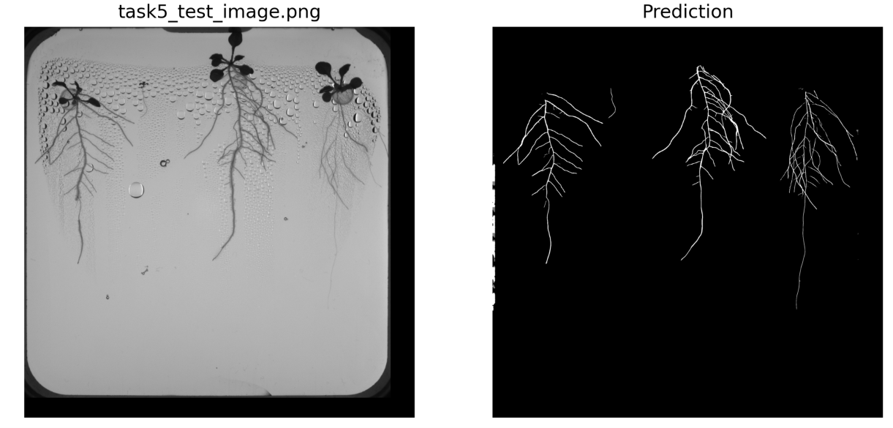

# NPEC · Root Analysis, Robotics and Inpainting Research

**Two pieces of work with the Netherlands Plant Eco-phenotyping Centre on *Arabidopsis* root phenotyping: a pipeline from plate photo to robot inoculation, and a study on repairing gaps in root masks.**

## Part 1 · Photo to robot

```
plate photo -> U-Net segmentation -> skeleton -> Dijkstra root tip -> pixel-to-robot transform -> PID control
```

- **Segmentation:** a 4-class U-Net (background, root, seed, shoot) with patch-based inference over 2912×2912 plate images, then morphological cleaning.
- **Measurement:** the mask is skeletonised and Dijkstra traces the longest path from the root tip. It measured 611 to 1,300+ pixel roots on a test batch and correctly returned zero for a plant with no visible root.
- **Robot control:** the tip coordinate is mapped into the OT-2 robot's space and a tuned **PID controller** reaches it with under 1 mm final error on every target. An RL controller (SAC/PPO in a PyBullet simulation) was trained as an alternative.

<p align="center">
  
  
</p>

## Part 2 · Root-gap inpainting study

Segmentation leaves gaps in roots, and gaps break length measurement. The question: does a learned model fill them better than classical image processing?

- **Compared:** U-Net with BCE loss, U-Net with Dice loss, morphological closing, and a graph-based method.
- **Metrics:** gap MAE, gap F1 and connected-component change (Chen et al. 2018). Train, validation and test were split by source image to prevent leakage.
- **Result:** the **BCE U-Net** won on all three metrics. Wilcoxon signed-rank tests with Bonferroni correction rejected every pairwise null at **p < 0.001 across 9,014 test patches**.
- **Limitations:** the gaps were synthetic, and the result is specific to *Arabidopsis*.

[Research poster (PDF)](research_poster.pdf)

**Stack:** PyTorch · OpenCV · scikit-image · Stable-Baselines3 · PyBullet · SciPy
