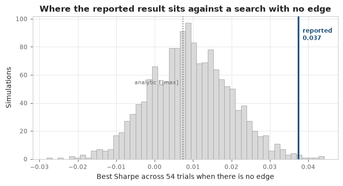
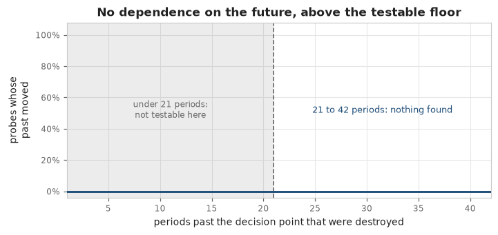
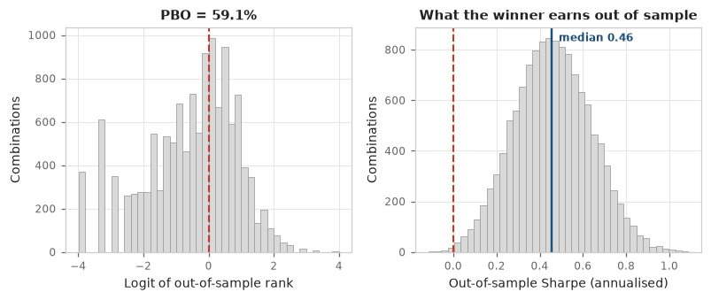

# proper_validation

**An adversarial validator for quantitative backtests. It attacks a backtest you have already run and reports how much of the claimed performance survives.**

➡️ **Code, case studies and full documentation: [github.com/honyakgergo/proper-validation](https://github.com/honyakgergo/proper-validation)**

---

## The problem

Backtest engines are mature, fast and free: `vectorbt`, `backtesting.py`, `zipline`, QuantConnect. `quantstats` will render a nice tearsheet of the result. **None of them tell you whether the result means anything.**

That question has been answered carefully over the last twenty years: Lo on the standard error of a Sharpe ratio, Bailey & López de Prado on the deflated Sharpe ratio and the probability of backtest overfitting, Harvey & Liu on multiple testing, Politis & Romano on bootstrapping dependent series, Fama & French on factor exposure. But the answers live in separate papers, not in the tools people use. So strategies get built with excellent tooling, evaluated with none, and fail in production. The cause is usually a question nobody asked, not a bug.

proper_validation asks those questions. It assumes your arithmetic is correct and attacks everything else. It **falsifies; it cannot validate.** There is deliberately no `PASSED` verdict. The best outcome available is `NOT_FALSIFIED`.

## Two independent questions

| | **Statistical validation** | **Engine analysis** |
|---|---|---|
| **Asks** | Is the measured edge distinguishable from luck? | Can the backtest be trusted as an implementation? |
| **Fails when** | The edge is selection bias, factor exposure, or eaten by costs | The code reads the future, is not reproducible, or the edge is a timing artifact |
| **Needs** | A return series | A re-runnable strategy |

The statistical suite covers the deflated Sharpe ratio against a simulated best-of-N null, PBO via combinatorially symmetric cross-validation, Fama-French 5 + momentum attribution with Newey-West errors, cost fragility from measured turnover, and survivorship **counted** against real S&P 500 / NASDAQ-100 membership history rather than just declared. The engine suite includes a behavioural look-ahead test: it destroys every price after a cut point, re-runs the strategy, and checks that no earlier decision changed. That catches leaks inside third-party library calls, which no static linter can reach.

<table>
<tr>
<td width="50%"></td>
<td width="50%"></td>
</tr>
</table>

## Worked example: dual momentum

A careful sector-rotation strategy with an absolute-momentum filter, a bond and gold defensive leg, and volatility targeting. Over twenty years it **beats the S&P 500 on Sharpe (0.540 vs 0.530) and halves the worst drawdown (−27% vs −55%)**. The engine analysis finds nothing wrong with it. The statistical suite still marks it as **materially weakened**:

- **The alpha is factor exposure.** After FF5 + momentum, alpha is 0.47% a year at t = 0.30, with a momentum loading of 0.235 at t = 10.1. You can buy that factor directly.
- **The selection procedure does not generalise.** PBO is 59.1% across 12,870 combinations, so the in-sample winner lands in the bottom half out-of-sample more often than not.
- **Honest accounting halves the headline.** A claimed Sharpe of 0.67 becomes 0.31 once returns are measured in excess of cash, annualisation is corrected for serial correlation, costs are charged, and multiple testing is accounted for.

The code is clean but the statistics are weak. Keeping two separate verdicts shows which one failed. A single blended verdict would say "weakened" without telling you what to fix.

## Detection rates are measured, not asserted

`benchmarks/` generates nine labelled strategies whose true edge is known by construction (mined noise, a `shift(-1)` leak, a full-sample scaler, a regime fluke, a cost-fragile edge, levered beta, and one with a **real, planted edge**) and audits 25 replications of each:

| | Result |
|---|---|
| Detection across the eight no-edge labels | **96%** |
| False positives on the label with a real edge | **0%** |

## How it's used

A `qv` CLI (`qv validate`, `qv scan notebook.ipynb`, `qv trials`, `qv explain <FINDING-ID>`) plus a **Claude Code skill**. With the skill, an agent reads your notebook, lifts the strategy into an adapter, fills in a manifest, runs the deterministic CLI and interprets the findings instead of making up statistics. Each run produces a self-contained `report.html`. Every number in it is also in `report.json`, and the footer records the engine version, commit and data vintage, so a report can be reproduced.

**Stack:** Python 3.11/3.12 · NumPy · pandas · SciPy · statsmodels · yfinance · pytest (1,075 tests, 97% coverage) · GitHub Actions
