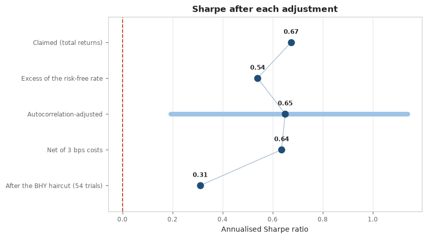

# proper_validation

**An adversarial validator for quantitative backtests: it attacks a backtest you have already run and reports how much of the claimed edge survives.** Code and case studies: [github.com/honyakgergo/proper-validation](https://github.com/honyakgergo/proper-validation)

Backtest engines are mature and free. None of them tell you whether the result means anything. The methods to answer that exist (Lo, Bailey and López de Prado, Harvey and Liu, Fama and French), but in separate papers rather than in tools. proper_validation puts them together. It can falsify a strategy but never validate one: the best verdict is `NOT_FALSIFIED`.

## Two separate verdicts

- **Statistical:** is the edge distinguishable from luck? Deflated Sharpe against a simulated best-of-N null, probability of backtest overfitting (CSCV), Fama-French 5 + momentum attribution with Newey-West errors, cost fragility from measured turnover, and survivorship counted against real index membership.
- **Engine:** can the code be trusted? The behavioural look-ahead test destroys every price after a cut point, re-runs the strategy and checks that no earlier decision changed. That catches leaks inside library calls that no linter can see.

## Example: dual momentum

A careful sector-rotation strategy beats the S&P 500 on Sharpe and halves its worst drawdown, and the engine check finds nothing wrong. The statistics still mark it **materially weakened**: the alpha is momentum exposure (t = 0.30 after factors), PBO is 59%, and a claimed Sharpe of 0.67 drops to 0.31 after cash, autocorrelation, costs and multiple testing.

## Measured detection rate

Nine labelled benchmark strategies with known edges (mined noise, a `shift(-1)` leak, a full-sample scaler, a cost-fragile edge, levered beta, and one real edge), 25 runs each:

| | Result |
|---|---|
| Defects caught on the eight no-edge strategies | **96%** |
| False positives on the real edge | **0%** |

It ships as a `qv` CLI and a Claude Code skill, and every run writes a reproducible `report.html` and `report.json`.

**Stack:** Python · NumPy · pandas · SciPy · statsmodels · pytest (1,075 tests, 97% coverage) · GitHub Actions
