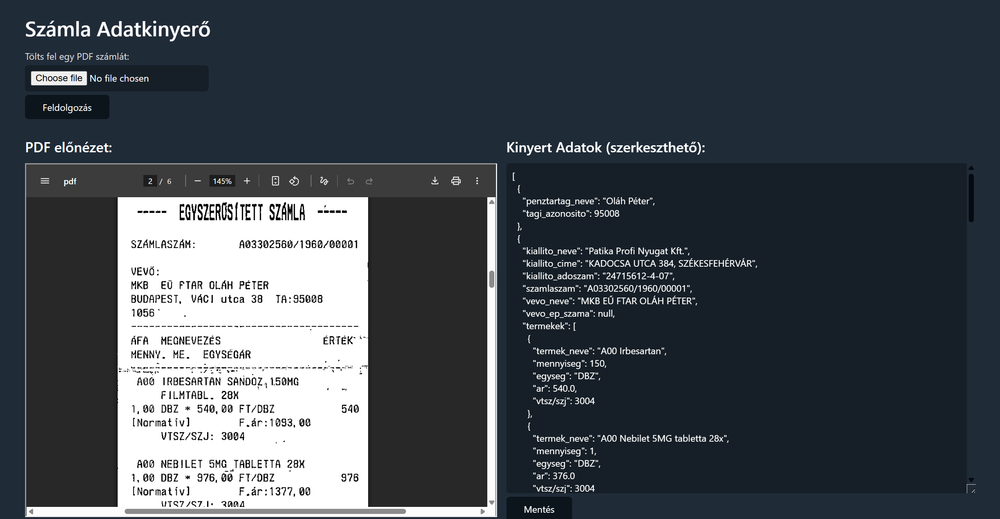

# Receipt extraction OCR + LLM

**Turning messy scanned receipts into clean structured data, no manual retyping.**

Solo · Applied ML pipeline · 2025 · Complete

| OCR pass | Structuring | Built |
|---|---|---|
| **Tesseract** | **Llama** | **Jun–Sep 2025** |

---

Manually entering data from scanned receipts is slow and error-prone, especially when scans are low quality, skewed, or faded. This pipeline reads a scanned receipt and returns clean, structured data automatically.

Tesseract handles the raw OCR pass, pulling text out of the image even when quality is poor. That messy raw output is then passed to a Llama model, which cleans it up and structures it into the fields that matter (items, prices, totals, dates), correcting the kind of OCR noise that would trip up a purely rule-based parser.

**Stack:** `Python` · `Tesseract` · `Llama`
