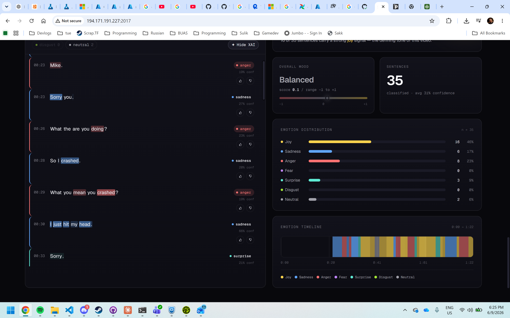
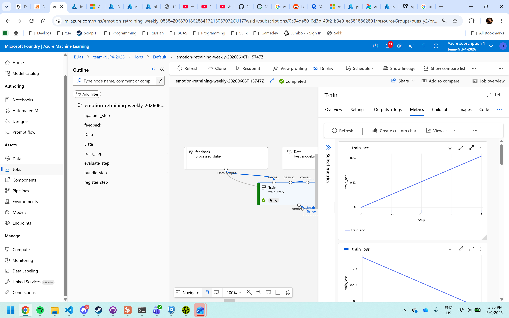
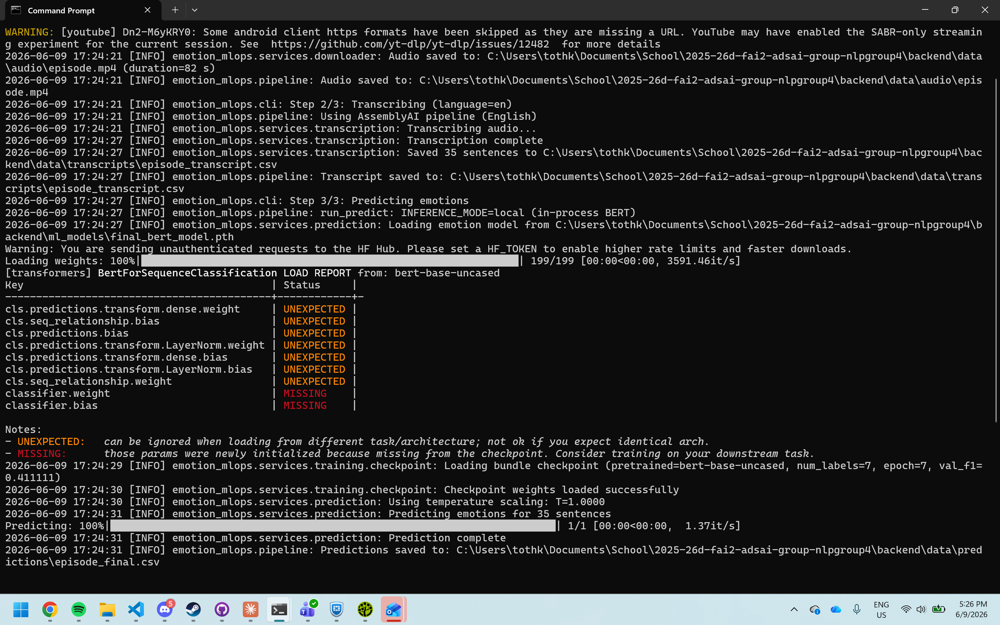
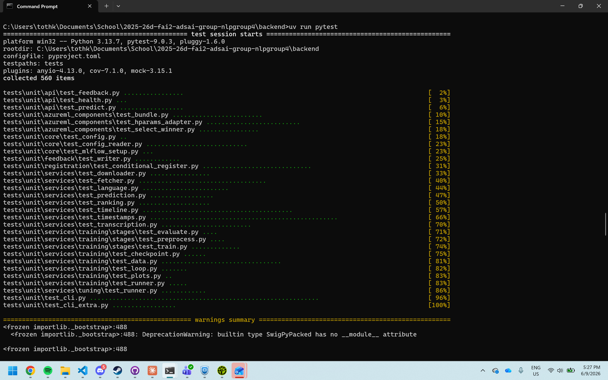
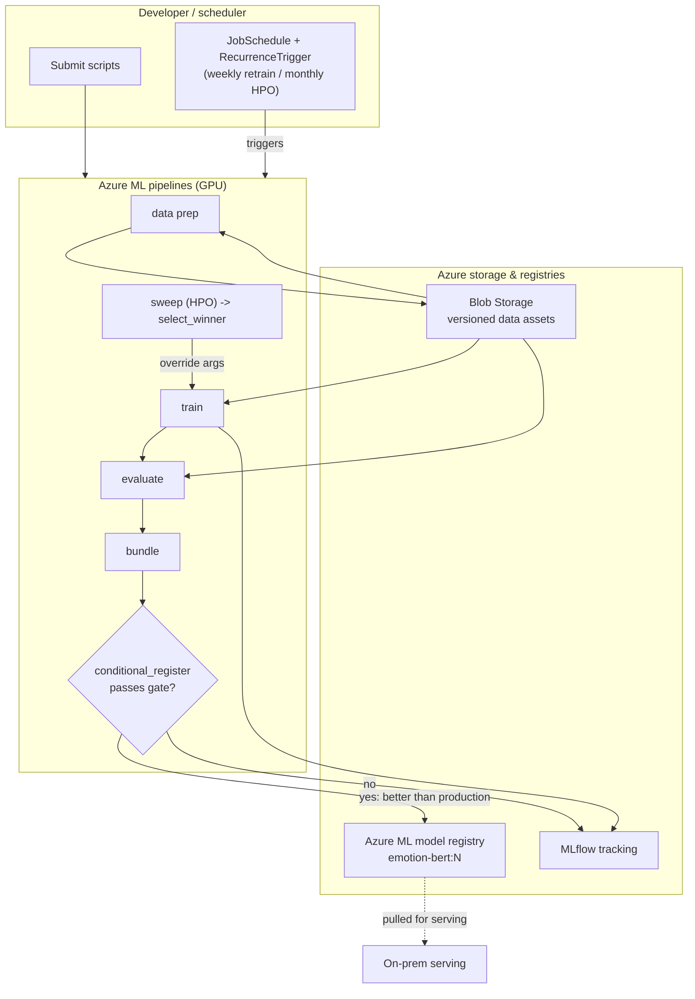
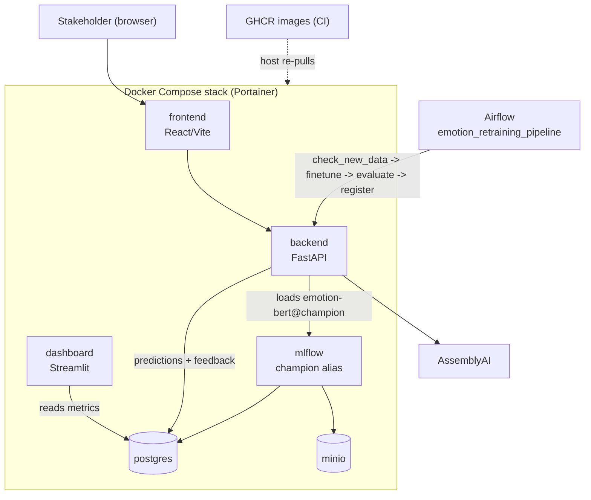
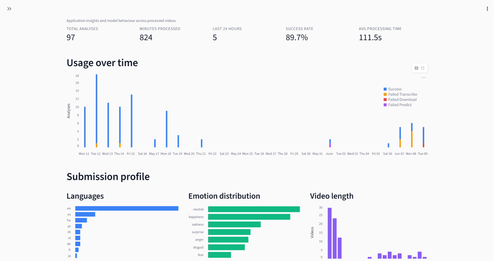
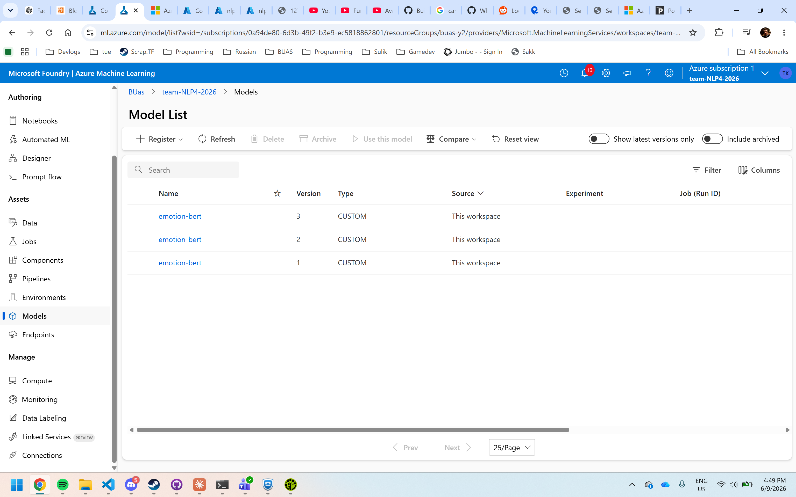
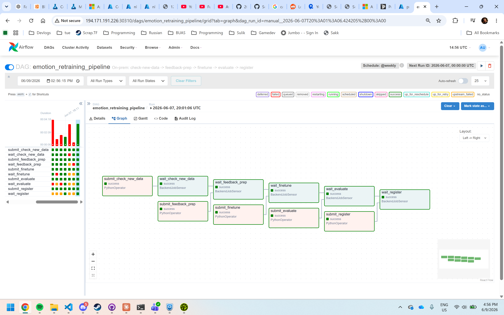

# Sentify — Emotion-Classification MLOps Pipeline

**A production-style MLOps system for Banijay Benelux that reads emotion out of media.** Give it a video or audio clip and it returns a full transcript with a per-sentence emotion label (Ekman's six + neutral) and a confidence score — so a media company can see, sentence by sentence, how a piece of content actually lands.

This was a team project for the BUas Block D MLOps module, and the emphasis was less on the model and more on everything that makes a model usable in production: packaging, serving, monitoring, automated retraining, and running the same artifacts in two very different environments.

  

## The model

A fine-tuned **BERT** classifier over seven classes (anger, disgust, fear, happiness, neutral, sadness, surprise). The biggest single win came from the loss function and optimiser: switching to **focal loss with AdamW** to handle heavy class imbalance lifted the macro **F1 from 0.41 to 0.84**. Predictions are made interpretable with **integrated gradients**, so a user can see which words pushed a sentence toward its predicted emotion rather than taking the label on faith.

  

## The pipeline

Audio is pulled with **yt-dlp**, transcribed and sentence-segmented via **AssemblyAI**, then classified. The whole thing is an installable Python package (`emotion_mlops`) with a **Typer CLI** — you can run the full pipeline or any single stage (download / transcribe / predict), and training is split into independently-runnable `preprocess → train → evaluate` stages so the same commands work locally and as cloud pipeline components.

  

Engineering quality was treated as a first-class deliverable: **210+ tests at 95% line coverage**, Google-style docstrings, structured logging, and fail-fast error handling throughout.

  

## Two environments, one package

The defining constraint of the project: the **same container images and the same package** run in the cloud (for heavy training) and on-premise (for serving), so a model behaves identically wherever it executes.

### Cloud — Azure ML

Training, hyperparameter sweeps, and retraining run on GPU as composable Azure ML pipeline components. Data is versioned in Blob Storage, experiments tracked in MLflow, and a **conditional-registration gate** means a worse model never reaches the registry — every registered model stays traceable to the exact data version it saw.

### On-premise — BUas Portainer server

Serving and an on-prem retraining loop run as a **Docker Compose** stack orchestrated on Portainer: a **React/Vite** frontend, a **FastAPI** backend (`/predict`, `/feedback`, `/jobs`), a **Streamlit** monitoring dashboard, **MLflow**, **Postgres**, and **MinIO**. Inference runs on CPU — cheap and plenty for a small BERT — which avoids an always-on cloud GPU endpoint. User corrections flow into Postgres and feed a retraining loop driven by **Airflow**, and CI builds/pushes images to GHCR so the host only re-pulls rather than rebuilds.

  
  

  

## Stack

`PyTorch` · `BERT / Transformers` · `focal loss + AdamW` · `integrated gradients` · `AssemblyAI` · `yt-dlp` · `Typer` · `FastAPI` · `React / Vite` · `Streamlit` · `MLflow` · `Airflow` · `Postgres` · `MinIO` · `Docker Compose` · `Portainer` · `Azure ML` · `GitHub Actions / GHCR` · `pytest` · `uv`

## What I took from it

This is the project where "train a model" became "run a system." The interesting problems weren't in the network — they were keeping cloud training and on-prem serving consistent, gating what gets registered, and closing the loop so user feedback actually improves the next model.
