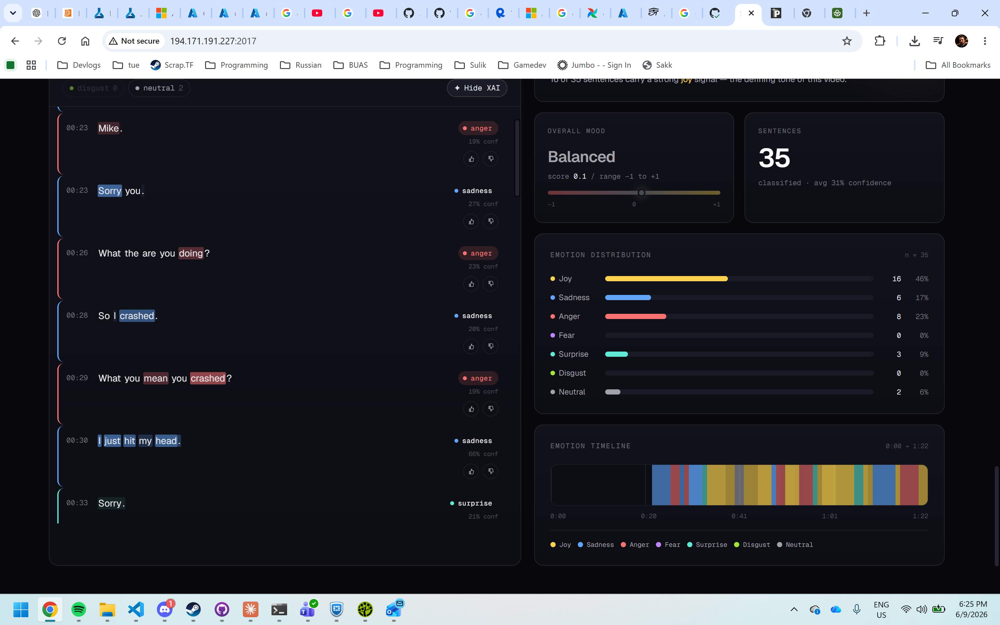
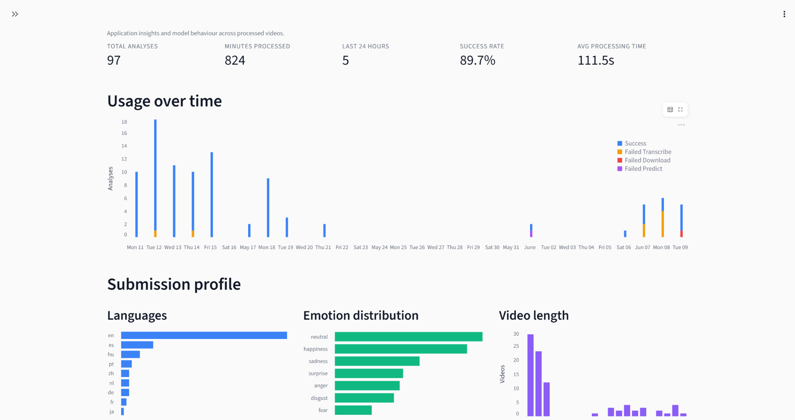
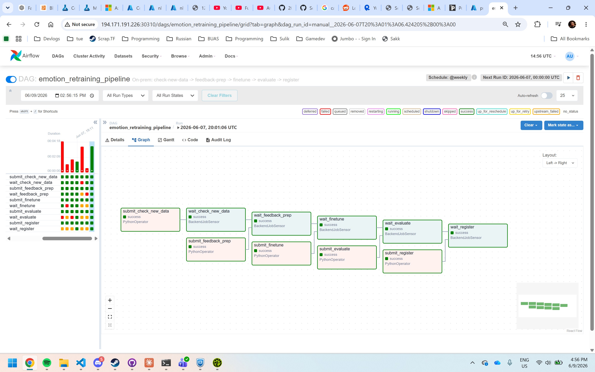

# Sentify · Emotion-Classification MLOps Pipeline

**Team project for Banijay Benelux: give it a video or audio clip, get back a transcript with an emotion label and confidence for every sentence.**

The brief was an MLOps module, so the focus was everything around the model: packaging, serving, monitoring and automated retraining, with the same containers running in the cloud and on-premise.

## Model

- Fine-tuned **BERT** over seven classes (Ekman's six plus neutral).
- The first setup (weighted sampler, weighted cross-entropy, high learning rate) collapsed to low-confidence predictions at macro F1 0.41. **Focal loss with AdamW at a lower learning rate** fixed it: macro F1 0.84.
- **Integrated gradients**, written directly in PyTorch, show which words drove each prediction.

## Pipeline

- yt-dlp downloads the audio, AssemblyAI transcribes and splits sentences, the model classifies.
- Installable Python package with a Typer CLI; `preprocess`, `train` and `evaluate` run as separate stages, locally or as cloud pipeline components.
- 210+ tests at 95% line coverage.

## Two environments, one package

- **Cloud (Azure ML):** GPU training, hyperparameter sweeps and scheduled retraining. Data is versioned in Blob Storage, experiments tracked in MLflow, and a registration gate means a model is only registered if it beats the current one.
- **On-premise (Portainer):** a Docker Compose stack with a React frontend, a FastAPI backend (`/predict`, `/feedback`, `/jobs`), a Streamlit monitoring dashboard, MLflow, Postgres and MinIO. Inference runs on CPU. User corrections are stored in Postgres and an **Airflow** DAG retrains on them.

  
  

**Stack:** PyTorch · Transformers · FastAPI · React · Streamlit · MLflow · Airflow · Postgres · MinIO · Docker Compose · Azure ML · GitHub Actions
