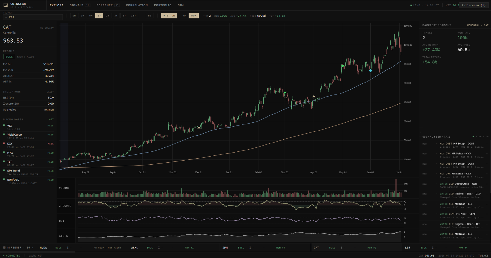
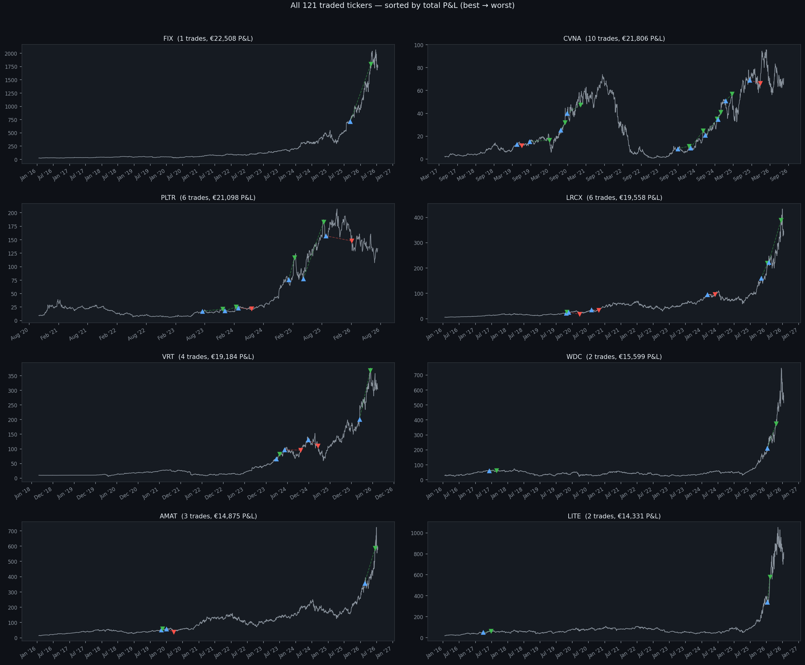
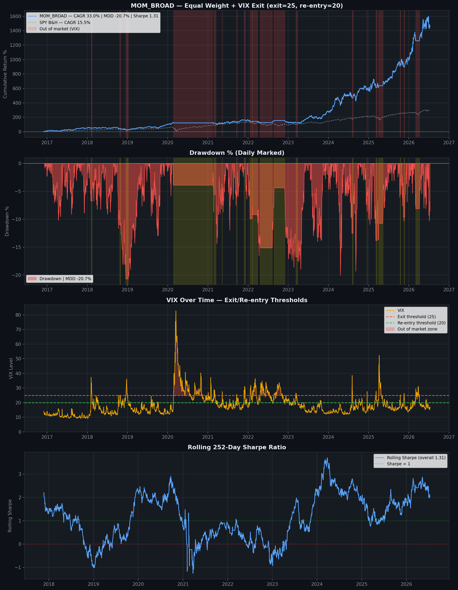
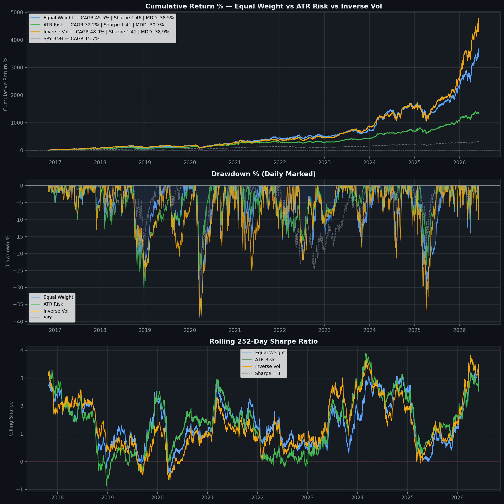
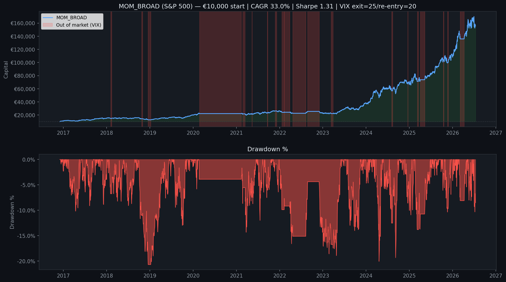
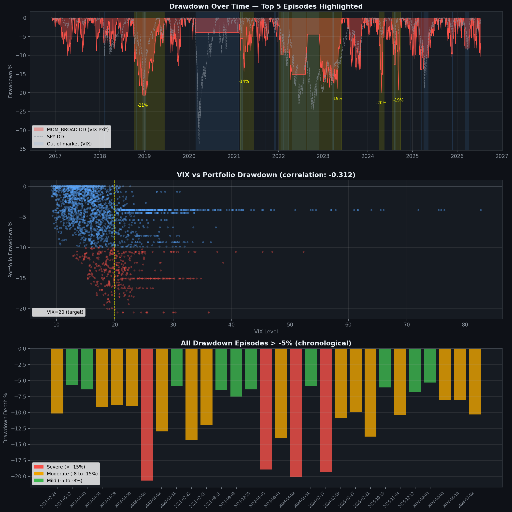
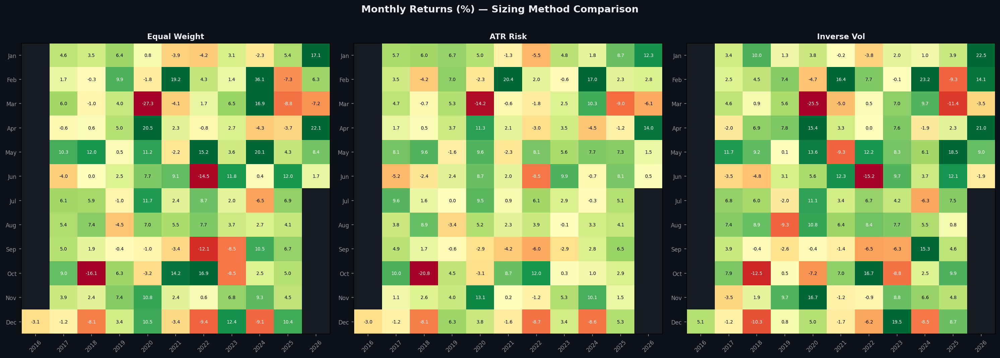
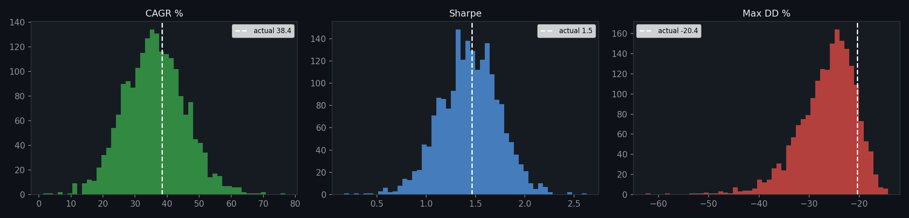
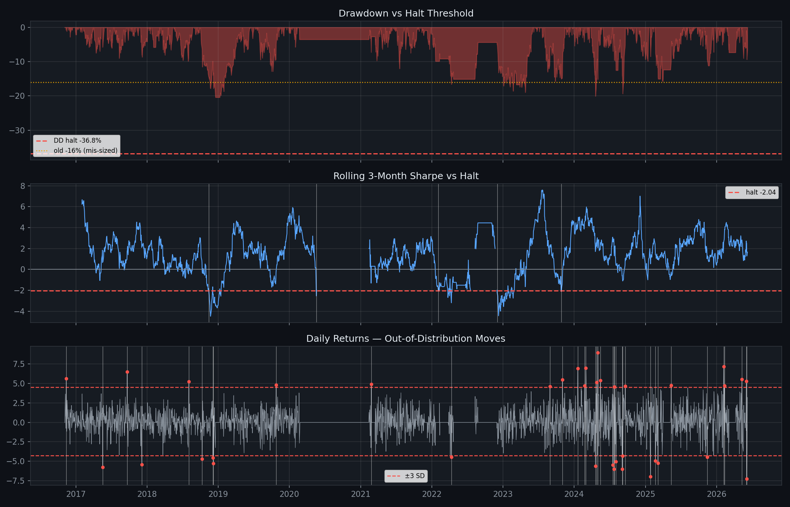

# SwingLab

**My quantitative research platform — and MOM_BROAD, the systematic momentum strategy that came out of it and now trades live with real capital.**

SwingLab is where a trading idea goes from a hypothesis to something I'd actually risk money on: a data layer, a backtesting and stress-testing engine, and a monitoring app, all built from scratch. The strategy it runs live — **MOM_BROAD** — is a broad cross-sectional momentum system over the S&P 500 + Nasdaq-100, developed and walk-forward validated inside the platform and live since January 2026.

---

## The platform

SwingLab is a **FastAPI backend + React/Vite frontend**. The point of building it was to stop trading off scattered notebooks and have one place where every strategy is researched, tested, and watched the same way:

- **Data layer** — price data from yfinance behind a thread-locked wrapper into a SQLite cache, warmed on startup and refreshed in the background, so research is fast and reproducible instead of re-hitting the API every run.
- **Signal library** — the indicators every strategy draws on (moving averages, RSI and ATR with Wilder smoothing, relative strength, regime detection).
- **Backtesting engine** — an event-driven simulator with **transaction costs modelled** (per-asset bps), position/risk caps, and a shared cash model.
- **Stress-testing** — walk-forward analysis, block-bootstrap Monte Carlo, and parameter sensitivity, because a single equity curve isn't evidence.
- **Monitor** — a React dashboard to watch the live book, signals, and regime.

The strategy research itself lives in versioned notebooks; MOM_BROAD is the one that graduated to live capital.

---

## MOM_BROAD — the strategy

A **broad cross-sectional momentum** system: rank a large universe by relative strength, hold the strongest names while a trend confirms them, and step aside when volatility says the odds have turned.

### Universe
The current **S&P 500 + the Nasdaq-100 names not already in it — ~515 tickers**, with GICS sectors. Seeded from Wikipedia at run time. *(The README in the notebook is upfront that using current constituents introduces survivorship bias that inflates returns by an estimated 1–3% CAGR — a real caveat, stated rather than hidden.)*

### Ranking & selection
- **Relative strength** measured as 189-day (≈9-month) excess return vs SPY, **skipping the most recent 21 days** to sidestep short-term reversal.
- Hold the **top 7** names, **equal-weight**, with a **maximum of 3 per sector** so the book can't become one giant tech bet.
- Weekly rebalance with a **12-week minimum hold** to keep turnover (and costs) down.

### Entry gate — a 2-of-3 trend vote
A name has to be *going up*, not just ranked highly. Entry requires RSI below 70 **and** at least **two of three trend indicators** agreeing:

- **EWMAC blend** — a Carver-style, volatility-normalised EWMA crossover across four speed pairs (4/16 through 32/128), so the signal is on the same scale for every asset and isn't curve-fit per ticker.
- **MACD** crossover (12/26/9).
- **Supertrend** (ATR-based).

Some of the best hystorical trades

### Feature selection — walk-forward Boruta
Rather than hand-pick features and risk fitting the past, the feature set is chosen by **Boruta** (a shadow-feature importance test) in **walk-forward** mode: refit every 12 months on a trailing window of at least two years, keeping only features that clear the threshold in ≥60% of 100 shuffles. Features are always selected on data the model hasn't traded yet — no look-ahead.

### Regime, macro & the VIX overlay
Entries are gated by a trend **regime** filter (50- vs 200-day MA with a tolerance band and bear-state hysteresis, so it doesn't whipsaw) and a **macro risk-on/off score** built from VIX, rates, credit spreads, and the dollar. On top sits a simple, effective **VIX overlay**: **move to cash when VIX crosses above 25, re-enter when it drops back below 20.**

### Position sizing — tested, not assumed
I A/B-tested several sizing schemes against plain equal-weight (Carver-style continuous sizing, volatility targeting, inverse-vol weighting). Each was kept only if it earned its complexity — mostly they didn't, so equal-weight stayed.

---

## Results

Over the backtest (Dec 2016 → Jul 2026), MOM_BROAD grew **€10,000 into roughly €155,000 — about a 33% CAGR** before the survivorship caveat above. More important than the headline number is *how* it got there: the VIX overlay and trend gate are designed to cut the deep drawdowns that plain momentum suffers in a crash.

  

### Validation

Because a good backtest is easy to fake, the strategy is checked the way I'd want it checked before trusting it: **walk-forward** (so nothing is chosen on data it later trades), a **block-bootstrap Monte Carlo** that reshuffles the return stream to map the distribution of outcomes rather than the single lucky path, and **circuit breakers** that define, in advance, the live drawdown at which the system stands down.

  

  

  

  

---

## Honesty box

The things the backtest does **not** get to pretend away: current-constituent universes carry survivorship bias (flagged, ~1–3% CAGR); transaction costs are modelled but slippage is approximate; and live results since January 2026 are a tiny sample, not a verdict. Writing these down is part of the discipline — a strategy you can't criticise is one you don't understand.

## Stack

`Python` · `FastAPI` · `pandas` / `NumPy` · `SciPy` · `scikit-learn` (Boruta) · `yfinance` · `SQLite` · `Matplotlib` · `React` · `Vite`
