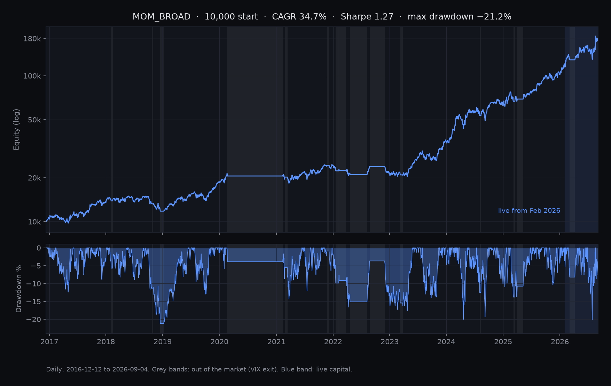

# MOM_BROAD

**A weekly cross-sectional momentum strategy on US large caps, trading my own and my family's capital since February 2026.**

| | Backtest (Dec 2016 to Sep 2026) | Live (Feb 2026 to Sep 2026) |
|---|---|---|
| Return | +1,712% (34.7% CAGR) | +51.8% |
| Sharpe | 1.27 | 1.59 |
| Max drawdown | -21.2% | -20.1% |

## The rules

- **Universe:** the current S&P 500 plus the Nasdaq-100 names not in it, about 515 stocks with GICS sectors.
- **Ranking:** 189-day return in excess of SPY, skipping the last 21 days to avoid short-term reversal. Only stocks beating SPY qualify.
- **Entry gate:** the stock is in a bull regime (50-day MA above the 200-day, with a 2% band and three confirmations before calling a bear), RSI(14) is at most 70, and at least 2 of 3 trend signals agree: a Carver EWMAC blend over four speeds (4/16 to 32/128, volatility-normalised), MACD 12/26/9, and Supertrend.
- **Macro gate:** no new entries unless at least 3 of 7 risk-on conditions hold (VIX, yield curve, dollar, credit, bonds, SPY and EURUSD against their 20-day trends).
- **Portfolio:** top 7, equal weight, at most 3 per sector, rebalanced weekly, 10 bps costs per trade.
- **Exits:** bear regime, RSI above 75, negative absolute momentum, or dropping out of the top 14 once the 12-week minimum hold has passed.
- **VIX overlay:** the backtest moves to cash above VIX 25 and back in below 20.

## How it got here

1. **Earlier experiments.** Sector rotation on industry-group relative strength, and three momentum-acceleration variants (simple acceleration, Antonacci-style multi-lookback, frog-in-the-pan). MOM_BROAD grew out of these.
2. **Removing look-ahead.** The first version picked tickers with a Boruta filter and tuned EMAs with a grid search over the full sample. Rebuilt walk-forward, refitting yearly on trailing data only, Boruta kept 514 of 515 tickers, so it was doing nothing and was removed. Every stock now uses the same fixed EWMAC speeds.
3. **Sizing and regime tests.** Inverse-volatility, volatility targeting and Carver continuous sizing were A/B tested against equal weight, and a Gaussian HMM regime model against the plain VIX rule. None was worth the extra complexity, so the simple versions stayed.
4. **Going live exposed things the backtest hid.**
   - Holdings changed between runs because yfinance re-adjusts history on every dividend and split, and with a hard top-7 cap and a 12-week hold, one borderline flip reshuffles every later rebalance. The live runner now reads a state file of actual fills and never replays history.
   - In the backtest the VIX exit is a return mask: the book resumes as if it had been held. Live, you would re-enter a different book, so the backtest Sharpe is slightly optimistic. Live, the VIX signal is a flag and my decision gets logged.
   - The sector cap was only applied to new candidates, which is how the book ended up with four tech names.
   - On 22 September 2026 Yahoo served a bar with no closes, blank prices read as failed momentum, and the runner proposed selling the whole book. A trading date now needs 90% universe coverage, and missing data is treated as unknown, never as a sell signal.

## Survivorship-free test

The headline backtest uses today's index members, which flatters momentum because it only includes stocks that survived. So I re-ran it on point-in-time index membership, trading only the stocks that were actually in the index on each date. The result is **21% CAGR, a 0.84 Sharpe, a -32% max drawdown and a 58% win rate**. That is well below the headline figures, so survivorship was worth about 14 points of CAGR. But the strategy still returns clearly more than SPY, with a Sharpe and a max drawdown slightly better than SPY's, and the win rate did not change.

## Caveats

- **Survivorship bias.** The headline numbers use today's constituents. The survivorship-free result above is the more honest backtest.
- **Many rules.** Lookbacks, thresholds and caps add up to a lot of choices, so the backtest is an upper bound, not an estimate.
- **Short live record.** Seven months of live trading is not statistical evidence.
- **Costs.** A flat 10 bps per trade, no slippage model.

**Stack:** Python · pandas · NumPy · yfinance · Matplotlib
