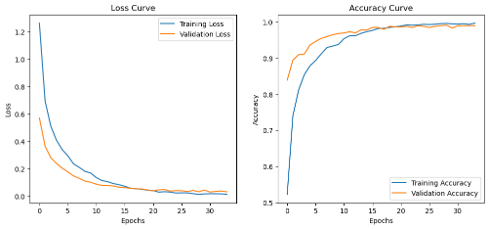
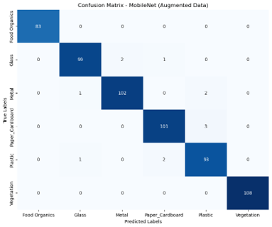
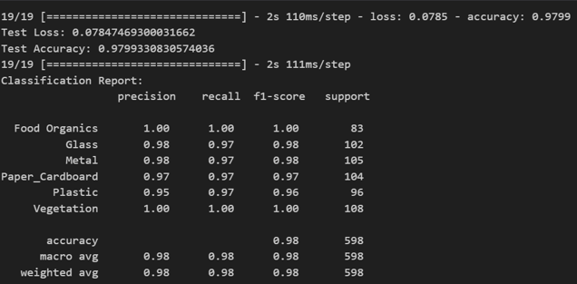
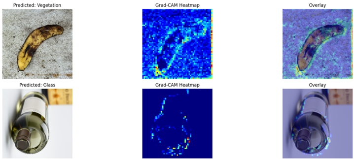
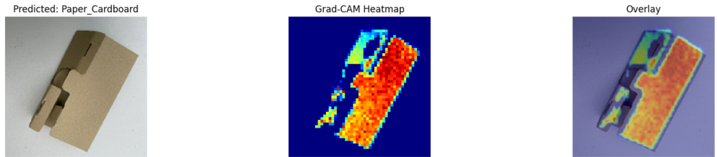

# Waste Warrior

**A deep-learning waste classifier, wrapped in a real deployed app — not just a notebook model.**

Waste Warrior takes a photo of a piece of rubbish and tells you which bin it belongs in. Point your phone at an item, and it returns the predicted waste type along with a colour-coded bin — blue for paper, yellow for plastic, and so on — so the disposal decision is immediate. It was my first-year deep-learning project at BUas, built for the Innovation Square brief, and I used it to learn what it actually takes to ship a model rather than just train one.

  
  

## The idea

Most people want to recycle correctly — they just don't always know which bin a given item goes in, and a wrong guess contaminates the whole batch. The goal was a phone-friendly classifier that removes the guesswork at the moment of disposal, and to build it as a complete product: a trained model behind an actual application, with accounts, a camera interface, and explainable predictions.

## Two models, one honest comparison

I trained two classifiers and compared them fairly on the same data.

- **A custom CNN** — three convolutional blocks with batch normalization and dropout, trained from scratch. It reached **76.8%** on the original dataset and **69.4%** under a harder augmented set (rotations, shifts, distortions). A decent baseline, but clearly limited by how much a small dataset can teach a network from zero.
- **A MobileNet backbone, fine-tuned** via transfer learning on ImageNet weights. This lifted test accuracy to **97.7%**, with strong precision and recall across every category and only rare, genuinely ambiguous misclassifications.

  

The transfer-learning model was the clear winner — the pretrained features did far more for a dataset this size than any amount of extra training from scratch.

  
  

## Making it explainable

A recycling app that says "trust me" isn't good enough, so I spent real time on the *why*. Using Grad-CAM, LIME, and integrated gradients, I checked that the model was looking at the actual object rather than the background — the heatmaps light up on the item itself, which is exactly what you want before you believe an accuracy number.

  
  

## The application

Around the model sits a full Flask app, not a demo script:

- **Backend** — Flask with SQLAlchemy over SQLite, exposing a `/predict` route that loads the trained model and returns the class plus its bin colour.
- **Accounts** — session-based auth through Flask-Login, with bcrypt-hashed passwords and full register / login / logout flows.
- **Frontend** — a clean HTML, CSS, and JavaScript interface with a phone-style camera capture and file upload, holding up across devices.

I also ran a small **A/B test** and think-aloud sessions on the interface as part of the human-centred side of the project.

## Stack

`TensorFlow / Keras` · `MobileNet (transfer learning)` · `scikit-learn` · `NumPy` · `Matplotlib` · `Seaborn` · `Flask` · `SQLAlchemy` · `Flask-Login` · `SQLite`

## What I took from it

The lesson that stuck: **the model is the easy part.** Getting to 97.7% was mostly picking transfer learning over a from-scratch CNN. The harder, more useful work was everything around it — honest evaluation, checking the model looked at the right pixels, and wrapping it in something a person could actually use.
