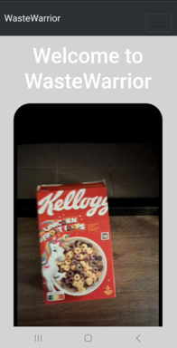
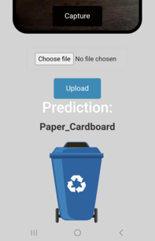
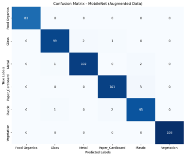
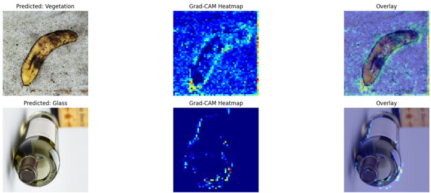

# Waste Warrior

**A waste image classifier inside a Flask app: take a photo, get the waste type and the right bin.** My first-year deep learning project at BUas.

  
  

## Models

- **Custom CNN** (three conv blocks, batch norm, dropout): 76.8% on the original data, 69.4% on a harder augmented set.
- **MobileNet transfer learning** from ImageNet weights: **97.7% test accuracy**, with the few errors on genuinely ambiguous items.
- **Grad-CAM, LIME and integrated gradients** confirm the model looks at the object, not the background.

  
  

## App

A Flask backend with a `/predict` route, SQLAlchemy over SQLite, accounts with bcrypt-hashed passwords, and a phone-style camera interface. A small A/B test and think-aloud sessions shaped the interface.

**Stack:** TensorFlow / Keras · MobileNet · scikit-learn · Flask · SQLAlchemy · SQLite
